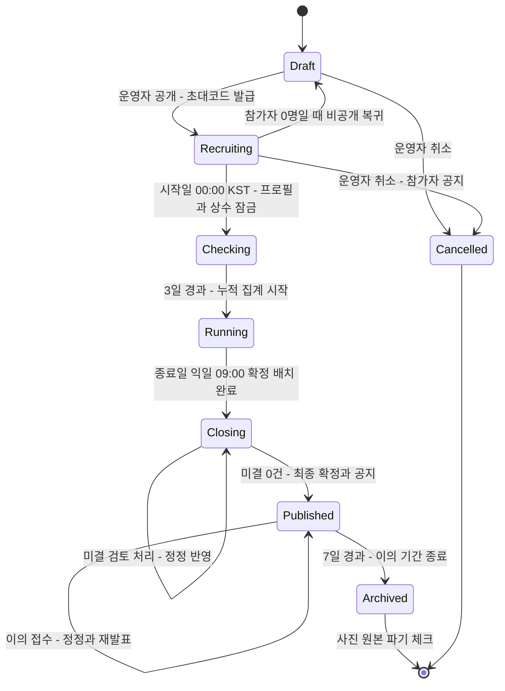

# 03. 기능정의서 (PRD) — 챌로리 (Challory)

작성일: 2026-10-01 | 근거: `01-유사앱-조사.md`(5·8장), `02-설계-결정-기록.md`(결정 준수) | 다음: 04-칼로리 엔진 및 순위 규칙, 06-화면 설계

표기: 02 결정에 없는 세부는 **[제안]**. 모든 칼로리·점수는 "측정" 아닌 **"추정"**(App Store 1.4.1).

---

## 1. 제품 개요·목표·성공지표

**정의**: 챌로리는 폐쇄형 다이어트 챌린지(30~100명, 7~30일, 개인전, 무상금) 참가자가 걸음·달리기·계단 **자동 기록**과 **식사 사진 3초 촬영**만으로 매일 0~150점을 받고 순위를 보는 모바일 앱이다. 운영자는 웹 콘솔 4페이지로 설정→참가자→판정→발표를 분쟁 없이 끝낸다.

**문제 → 답**(조사 근거): 순칼로리 최소=1등의 굶기·미기록 보상(4.5) → 달성률 S_d·하한 F_p·대체값 M_p / 기기 오차 ±30%(4.4) → 전원 동일 MET 엔진 / 음식 AI 오차 ±26~36%(4.2) → 편집 가능한 초안 / 판정 모호·번복(4.3) → 규칙=적용 SQL, SLA 72h, '미결 0건' 차단 / 유료화 반발(7-1) → 무료·무광고.

**목표(1회차)**: G1 하루 1분 입력으로 순위 반영 / G2 "왜 저 사람이 위인가"에 장부 숫자로 답한다 / G3 운영자 1인이 100명을 번복 없이 종료 / G4 건강·법규 안전선.

**KPI [제안]**

| 지표 | 정의 | 목표 |
|---|---|---|
| 끼니 확정률 | 확정 끼니 ÷ (참가자×일×3) | ≥80% |
| 동기화 반영률 | 09:00 확정 시 당일 걸음 레코드 보유 비율 | ≥95% |
| 촬영→홈 복귀 / AI 분석 완료 | p95 | ≤3초 / ≤6초 |
| 검토 SLA 준수율 | 72h 내 판정 비율 | 100% |
| AI 초안 수정폭 | median(\|confirmed−ai\|÷confirmed) | ≤25% |

---

## 2. 페르소나·이용 시나리오

| | 참가자 "지수" | 운영자 "민호" |
|---|---|---|
| 프로필 | 30세 직장인(1996년생, 시작일 기준 만 나이), Galaxy 폰 단독(워치 없음), 삼성헬스 사용, 챌린저스 인증샷 경험 | 38세 사내 복지 담당, 비개발자, 1인 운영, 엑셀·카카오톡으로 공지 |
| 목표 | 3끼 사진과 걸음만으로 순위를 올린다. 찍는 데 10초 넘으면 안 찍는다 | 30~100명 챌린지 1회를 분쟁 없이 끝내고 CSV를 받는다 |
| 불안 | "왜 저 사람이 위인가", 워치 사용자에게 질 것 같음, 사진 공개 수치심 | 판정 모호 항의, 걸음 0 응대, 발표 뒤 번복 |
| 대응 | 전원 동일 MET 공식, 3초 캡처 후 나중 확정, 사진 비공개·공개 지목 없음 | 규칙 카드=적용 규칙(`/simulate`), SLA 72h, '미결 0건' 발표 차단 |

**지수의 하루**: 07:50 아침 촬영 3초 → 홈 복귀. 12:30 밥상 촬영, '나중에 확정'. 14:00 분석 완료 푸시 → top-3 칩 "된장찌개", 밥 '반 공기', '먹은 것만 체크'. 19:40 라면, 국물 OFF 확정 → 링 "잠정 28점·14위". 21:00 푸시로 미확정 끼니 확정. 09:30 "어제 32.4점, 누적 11위" → P10에서 9,200보→A=301 kcal 확인.

**민호의 1회차**: D−7 OP1 설정·샘플 3명 시뮬레이션·초대코드 배포 → D−1 OP2 미연결자 공지 → D+1~3 점검 기간 걸음 0 출처 확인 → OP3 소명 읽고 템플릿 판정 → 종료 익일 '미결 0건' 확인 후 확정·공지, 7일 이의 → CSV 4종·사진 파기.

---

## 3. 범위(MVP / v1.1~v2)

| 영역 | MVP(1회차 확정) | v1.1~v2(보류) |
|---|---|---|
| 계정·참가 | Kakao/Apple 로그인, 6자리 초대코드, 초대 링크 = 웹 랜딩(코드·스토어 버튼) + 설치자 Universal Links/App Links 자동 입력 + 첫 실행 클립보드 코드 감지 **[제안]** | 공개 모집, QR, 알림톡, 유료 deferred deep link(Branch·Airbridge 등, 미설치자 코드 전달), 다국어 |
| 프로필·자격 | 4항목→즉시 BMR, 만 14세 미만 차단, 기록 모드(만 19세 미만·BMI<18.5·임신/수유·섭식장애 병력), 시작 시 잠금 | 체중 보조 리더보드, 규칙 재동의 |
| 활동 | HealthKit/Health Connect 일별 집계만, 수동 제외, 3일 재조회, MET 엔진(걸음 3.8 고정+자동 세션+층수 50층 상한) | 케이던스 가변 MET, 기압계 층수, 심박 존 리그, 벤더 API |
| 식사 | 인앱 카메라, 3초 복귀, Gemini 2.5 Flash JSON→식약처 DB, 편집·확정 UI, 검색·최근·직접 입력, 150 kcal 미만 간식 | 바코드·OCR·음성, FoodLens A/B, 평가셋 게이트 |
| 점수·순위 | 산식 1개, 매시간 잠정, D+1 09:00 확정, 장부, 리더보드 오늘/누적, 반영률 4칸, 응원, 익명 신고 | 팀전, 주간 탭, 운영자 순위 옵션, T∝W(장부 병기 후) |
| 공정·안전 | 자동 플래그 5종, 검토 중→소명 1회(72h)→판정 4단계, 건강 신호 비공개 알림 | Play Integrity/App Attest, pHash·워터마크, 2인 확인·RBAC |
| 콘솔·데이터 | 웹 4페이지, challenge_id 1급 키, CSV 4종, EXIF 제거·SHA-256, 종료+7일 파기 | 금전 정산·포인트·추첨, B2B 과금, 알림톡, 배지·스트릭 |

---

## 4. 사용자 스토리

우선순위 **M**(필수) / **S**(권장) / **C**(여유 시).

### 4.1 참가자

| id | 스토리 | 우선 | 화면 |
|---|---|---|---|
| U-01 | 참가자로서 카카오톡 초대 링크로 챌린지에 들어가고 싶다, 그래야 코드를 외우지 않아도 된다 — 설치자는 링크로 코드가 바로 입력되고, 미설치자는 랜딩에서 복사한 코드(또는 설치 후 링크 재탭)가 자동 입력된다 | M | P1 |
| U-02 | 참가자로서 4항목만 넣고 BMR과 하루 목표를 바로 보고 싶다, 그래야 긴 온보딩 없이 시작한다 | M | P2 |
| U-03 | 참가자로서 사진의 해외 AI 전송을 거절할 수 있길 원한다, 그래야 불이익 없이 프라이버시를 지킨다 | M | P3 |
| U-04 | 참가자로서 연결 직후 '오늘 N걸음 읽었어요'를 보고 싶다, 그래야 걸음 0으로 하루를 날리지 않는다 | M | P4 |
| U-05 | Galaxy 사용자로서 삼성헬스→Health Connect 가이드를 보고 싶다, 그래야 워치 없이도 걸음이 반영된다 | M | P4 |
| U-06 | 참가자로서 링 하나로 오늘 순적자와 달성 정도를 알고 싶다, 그래야 3숫자만 보고 다음 행동을 정한다 | M | P5 |
| U-07 | 참가자로서 3초 안에 찍고 홈으로 돌아오고 싶다, 그래야 하루 3번이 부담되지 않는다 | M | P6 |
| U-08 | 참가자로서 찍어두고 나중에 확정하고 싶다, 그래야 식사 자리에서 편집하지 않는다 | M | P6, P7 |
| U-09 | 참가자로서 top-3 칩으로 음식을 바꾸면 kcal도 바뀌길 원한다, 그래야 "이름만 바뀌는" 일이 없다 | M | P7 |
| U-10 | 참가자로서 반 공기·국물 안 먹음·반찬 1젓가락 단위로 고치고 싶다, 그래야 그램을 몰라도 정확하다 | M | P7 |
| U-11 | 참가자로서 인식 실패 시 검색·직접 입력으로 바로 넘어가고 싶다, 그래야 끼니를 비우지 않는다 | M | P6, P7 |
| U-12 | 참가자로서 미확정 끼니의 09:00 처리 규칙을 미리 알고 싶다, 그래야 자동 확정값에 놀라지 않는다 | M | P7, P11 |
| U-13 | 참가자로서 걸음·세션·층수별 kcal과 미인정 사유를 보고 싶다, 그래야 워치 사용자와 같은 공식임을 믿는다 | M | P8 |
| U-14 | 참가자로서 오늘·누적 순위를 포디움·내 행 고정·격차로 보고 싶다, 그래야 중위권에도 다음 목표가 보인다 | M | P9 |
| U-15 | 참가자로서 의심 기록을 익명 신고하고 싶다, 그래야 보복 걱정 없이 공정성에 참여한다 | S | P9 |
| U-16 | 참가자로서 점수의 BMR/A/I/D/S 분해와 클램프·대체값을 보고 싶다, 그래야 스스로 재계산할 수 있다 | M | P10 |
| U-17 | 참가자로서 '검토 중' 사유를 나만 보고 72h 안에 1회 소명하고 싶다, 그래야 공개 지목 없이 오해를 푼다 | M | P10 |
| U-18 | 참가자로서 규칙 화면에서 내 숫자로 점수를 시뮬레이션하고 싶다, 그래야 "3,000보 더 걸으면 몇 점"을 안다 | S | P11 |
| U-19 | 참가자로서 앱 안에서 동의 철회·계정 삭제를 하고 싶다, 그래야 내 사진·건강 데이터가 남지 않는다 | M | P12 |
| U-20 | 기록 모드 참가자로서 제외 사유가 누구에게도 보이지 않길 원한다, 그래야 건강 정보가 노출되지 않는다 | M | P2, P9 |

### 4.2 운영자

| id | 스토리 | 우선 | 화면 |
|---|---|---|---|
| O-01 | 운영자로서 기간·정원·상수가 시작 후 잠기길 원한다, 그래야 "규칙이 바뀌었다"는 항의가 없다 | M | OP1 |
| O-02 | 운영자로서 규칙 Markdown을 P11과 똑같이 미리 보고 싶다, 그래야 쓴 규칙과 적용 규칙이 다르지 않다 | M | OP1 |
| O-03 | 운영자로서 샘플 3명으로 산식을 시뮬레이션하고 싶다, 그래야 상수 변경 효과를 공개 전에 확인한다 | M | OP1 |
| O-04 | 운영자로서 참가자별 동기화·출처·연결 상태를 표로 보고 싶다, 그래야 "걸음 0" 문의에 바로 답한다 | M | OP2 |
| O-05 | 운영자로서 순위 제외·강퇴·재가입 차단·메모를 하고 싶다, 그래야 레드카드 후 재가입을 막는다 | M | OP2 |
| O-06 | 운영자로서 건강 신호를 검토 큐 아닌 비공개 섹션에서 보고 싶다, 그래야 판정과 건강 배려를 섞지 않는다 | M | OP2 |
| O-07 | 운영자로서 플래그·신고·소명을 증거와 함께 한 큐에서 보고 싶다, 그래야 72h 안에 판정한다 | M | OP3 |
| O-08 | 운영자로서 판정 4단계별 점수 영향을 미리 보고 싶다, 그래야 무효 처리의 순위 영향을 알고 결정한다 | M | OP3 |
| O-09 | 운영자로서 사유 템플릿으로 당사자에게만 푸시하고 싶다, 그래야 문구가 일관되고 공개 지목이 없다 | M | OP3 |
| O-10 | 운영자로서 미결 건이 있으면 최종 확정이 막히길 원한다, 그래야 발표 뒤 번복이 없다 | M | OP4 |
| O-11 | 운영자로서 CSV 4종을 받고 이의 기간 후 사진을 파기하고 싶다, 그래야 보고와 보관 약속을 지킨다 | M | OP4 |

---

## 5. 기능 명세

상수는 챌린지 공통·시작 후 잠금.

### F-ACC 계정·참가

| id | 기능(화면) | 입력 → 출력 | 규칙 | 예외 |
|---|---|---|---|---|
| F-ACC-01 | 로그인·초대코드(P1) | 6자리 코드 또는 초대 링크(웹 랜딩: 챌린지명·코드 6자리 큰 글씨·'코드 복사'·스토어 버튼), OAuth 토큰 → 챌린지 요약 카드, 참가자 레코드 | 코드는 챌린지당 1개, 정원 초과·모집 종료 시 불가, 1인 1계정, iOS는 Apple 로그인 필수. 링크 자동 입력 **[제안]**: 설치자는 Universal Links/App Links로 즉시 입력, 미설치자는 랜딩 → 스토어 → 첫 실행 P1에서 클립보드 6자리 패턴 감지 시 입력 제안(iOS 16+ 붙여넣기 권한 배너 수용). 미설치자용 deferred deep link는 v1 미사용(Firebase Dynamic Links 2025-08 종료, 유료 솔루션은 v1.1 보류) | 재가입 차단자는 사유 비노출 거절. 클립보드 미감지 → 수동 입력 |
| F-ACC-02 | 프로필·자격 게이트(P2) | 성별·생년·키·체중 + 안전 체크 → BMR_p(Mifflin-St Jeor), 목표 T=500, 참가 유형 | 만 14세 미만 차단. 만 19세 미만(민법 성년 미만, 02 §3-2)·BMI<18.5·임신/수유·섭식장애 병력 → 기록 모드(점수 표시, 순위 제외, 사유 비공개). 나이는 시작일 기준 만 나이이며 생년(연도)만 수집하므로 14세·19세 판정은 해당 연도 12월 31일생으로 보수 적용 **[제안]**(06 P2) — 미달 가능 시 각각 차단·기록 모드. BMI<15·>45 재확인. 시작 시 잠금 | 시작 후 변경은 운영자 문의, OP2 메모 |
| F-ACC-03 | 동의 3분리(P3) | 약관(필수)/건강 민감정보(필수, 23조)/국외 AI 전송(선택, 28조의8) → 동의 레코드 | 선택 미동의 시 검색·직접 입력 경로만, 자격 불이익 없음. 보관 기간·추정치 면책 고지. 건강 민감정보 동의는 안전 체크(임신/수유·섭식장애) 문항을 보기 전에 받아야 하므로 P2 최상단에서 선취하고 P3는 완료 표시만 **[제안]**(06 흐름 1·P2); 3분리 레코드는 그대로 | 필수 미동의 → 참가 중단 |

### F-ACT-01 건강 데이터 연결·동기화 (P4, P8, P12)
- **설명**: HealthKit(iOS 15+)/Health Connect 읽기 권한을 교육 카드 뒤 기능 시점에 요청, 일별 집계를 참가자×일 1행에 저장.
- **입력** 걸음·거리·층수·운동 세션 레코드, 플랫폼 활동 칼로리(참고값, P8 표시 전용·순위 미반영), 메타(`WasUserEntered`, `recordingMethod`, 출처). 체중(bodyMass/WeightRecord)은 P4가 아닌 P12 "건강 앱에서 읽기" 최초 탭 시 별도 요청 **[제안]**(06 흐름 6), 산식 미반영 / **출력** 일별 활동 행, 출처 목록, 마지막 동기화 시각, '오늘 N걸음 읽었어요'.
- **규칙**: `HKStatisticsCollectionQuery`/`aggregateGroupByPeriod` 1일 집계만, 원시 합산 금지, Asia/Seoul 자정. 실행·복귀·백그라운드 전달 시 최근 3일 재조회. 수동 입력은 미인정. iOS는 `WasUserEntered≠true` predicate 집계로 수동 걸음을 차감해 검증/기록/미인정 걸음을 분리하고, Android aggregate는 recordingMethod 필터가 없어 수동 출처 감지 시 숫자 대신 플래그(04 §3.1, 06 P8) **[제안]**
- **예외**: iOS 권한 거부 감지 불가 → 걸음 0이면 '설정 확인' 상시 안내. HC 2회 취소 → 설정에서 복구. Android 13 이하 HC APK, Galaxy 삼성헬스→HC 가이드.

### F-ACT-02 소비 칼로리 MET 엔진 (P5, P8)
- **설명**: 전원 동일 공식 E_d = BMR_p + A_d, A_d = 걸음 net + 세션 net + 층수, 상한 C=1,000.
- **입력** 일별 활동 행, W, BMR_p / **출력** A_d(상한 전/후), 항목별 분해, 미인정 걸음·사유.
- **규칙**: 걸음 net = (세션 창 밖 걸음, 일 30,000 상한)×(3.8−1)×W/6,000(Compendium 17190 고정). 세션 net = Σ(MET−1)×W×h, 자동 기록만; 달리기 MET <8 km/h 7.5 / 8~9.6 8.5 / 9.7~12.8 9.3 / ≥12.9 12.0, 계단 세션 6.8, 걷기 세션은 걸음과 동일. 층수 = min(층, 50)×(6.8−1)×W×17.5/3,600(최대≈100 kcal). 플랫폼 활동 칼로리는 '참고값'.
- **예외**: 층수 데이터 없음 → 카드 숨김. 세션 거리 없음 → tier 7.5 **[제안]**. 걸음 >25,000 또는 개인 중앙값×2.5 → F-FAIR-01 플래그.

### F-MEAL-01 식사 촬영 (P6)
- **입력** 인앱 카메라 전용 프레임, 촬영 시각(서버 수신 시각 기준, 지연 업로드는 예외 참조), 끼니 자동 태그(변경 가능) / **출력** 사진(EXIF 제거, ≤1,568px), SHA-256, 끼니 `captured`(상태명은 9장 매핑), 분석 요청.
- **규칙**: 3초 내 홈 복귀, '나중에 확정' 기본, 갤러리 불가. 슬롯 시간대 **[제안]** 아침 04~10:30 / 점심 ~15 / 저녁 ~22시, 그 외 간식.
- **예외**: 오프라인 → 로컬 큐 후 자동 업로드 **[제안]**. 지연 업로드 **[제안]**: 업로드 요청에 `client_captured_at`·`queued=true` 포함, |서버 수신 − 단말 촬영 시각| ≤30분이면 서버 시각(플래그 없음); 30분 초과 ~ `late_upload_window`(12h, challenge_rules)이고 단말 날짜가 미확정이면 단말 시각으로 슬롯·날짜 태그 + '지연 업로드' 배지 + 보조 플래그 late_upload(값 유지·운영자 확인, 04 §7 #9); 12h 초과(미확정 날짜)는 서버 시각 태그 + late_upload 플래그; 단말 날짜가 이미 `is_final`이면 끼니 미인정(슬롯 미충족·I_d 미반영)·사진·해시만 보존(활동 `late_delta`와 동일 원칙). 사용자가 날짜를 직접 바꾸는 옵션은 두지 않는다(02 §7-6 서버 시각). 카메라 실패 → 검색 폴백. 국외 AI 미동의 → 분석 생략.

### F-MEAL-02 AI 초안·DB 매핑 (P6→P7)
- **설명**: Gemini 2.5 Flash(Vertex AI) JSON → 식약처 음식 표준데이터(15100070) 매핑 → ai_kcal → 분석 완료 푸시. Claude Haiku 4.5 어댑터.
- **입력** 사진, JSON 스키마 `is_food, items[{name_candidates[3], count, portion_bucket, has_broth, confidence}]` / **출력** 항목별 top-3 후보·분량·개수·국물·신뢰도, ai_kcal, 매핑 상태.
- **규칙**: kcal = 식약처 1인분 × 분량 배수 × 개수 × 국물 계수(0.6). pg_trgm + 동의어 100개. ai_kcal/confirmed_kcal 분리 저장.
- **예외**: `is_food=false` → 검색 폴백, 슬롯 미충족. 미매칭 → LLM 임시값 + '확인 필요' 배지. API 실패 → 1회 재시도 후 검색 안내 **[제안]**.

### F-MEAL-03 식사 확인·편집·확정 (P7)
- **입력** 후보 칩, 반 공기/1공기/곱빼기, 국물 토글, 개수 스테퍼, 반찬 1젓가락, '먹은 것만 체크', 검색·최근·직접 입력 / **출력** confirmed_kcal, 수정폭, 라벨(주식/간식). 확정값만 링·순위 반영.
- **규칙**: 이름 변경 시 kcal 즉시 재계산. 끼니 합 150 kcal 미만 → '간식'(슬롯 미충족). AI 대비 −50% 하향 → 확인 모달+플래그. 하단 고지 "09:00까지 미확정 시 max(대체값, 1.3×AI) 자동 확정, 이후 수정 가능". '건너뜀' 1일 1회·주 3회, I에 0.
- **예외**: 확정 후 재수정은 D+1 09:00(`is_final`) 전 자유(이력만), `is_final` 후 48시간 내 수정은 '정정'(전·후 값·누적 차액 기록), 48시간 이후 잠금(`locked_at`, 04 §4.3·T19). 건너뜀 한도 초과 → 버튼 비활성.

### F-SCORE-01 점수 산식·확정 배치 (P5, P10, P11, OP1)
- **설명**: SQL 함수 1개(`/simulate`)를 P5·P11·OP1·확정 배치가 공유.
- **입력** BMR_p, A_d, 확정 끼니(라벨·kcal·상태), 건너뜀, 상수 / **출력** I_d, D_d, S_d, 적용 클램프·대체값 목록, `is_final`.
- **규칙**: **D_d = (BMR_p + min(A_d, 1000)) − max(I_d, max(1200, 0.8·BMR)); S_d = 100 × clamp(D_d/500, 0, 1.5)**(0~150점). I_d = Σ 확정 끼니(≥150) + Σ 확정 간식(<150) + 빈 주식 슬롯 × M_p(=max(700, 0.45·BMR)); 간식은 슬롯을 채우지 않고 대체값도 없지만 kcal은 합산(끼니 분할 촬영 우회 차단, 02 §5·04 §4.3); 미확정 AI 초안은 09:00 배치에서 max(M_p, 1.3×AI) 자동 확정, 매시 잠정에서도 같은 값을 대체값으로 산입(04 §4.3 잠정 계산). 확정 끼니 0개 → S_d=0. 누적 Σ S_d, 동점 공동 순위. 매시간 잠정, D+1 09:00 KST `is_final`, 이후 판정 변경은 '정정'. 첫 3일 점검 기간은 누적 미반영. 골든 테스트: 70 kg 남·9,000보·1,800 kcal → 28.8점 / 58 kg 여·워치 달리기 30분·1,350 kcal → 72.1점 / 1끼 600만 확정 → 0점 / 예1 + 간식 커피 100 확정 → I 1,900·S 8.8(04 T24).
- **예외**: 기록 모드·경고 3회·강퇴는 계산하되 순위 제외(타인 미노출). '검토 중'은 잠정 유지.

### F-LB-01 리더보드 (P9)
- **입력** S_d, 누적, 반영률(끼니 3슬롯+동기화 1칸) / **출력** 오늘(잠정/확정)·누적 탭, 포디움 + 내 행 고정 + 격차, 반영률 칩, 등급 배지(기본 비공개), 응원, 신고, 주간 피드백.
- **규칙**: 동점 공동 순위. 순위 제외자는 명단 제외(사유 금지). 검토 중은 본인만 '검토 중', 타인에게 '집계 중'. 응원은 보낸 사람 기준 하루 1회(수신자별 아님, 05 cheers UNIQUE(from_participant_id, local_date)). 신고는 익명·대상 일자/끼니·사유 템플릿.
- **예외**: opt-out 참가자는 본인 행만. 페이지당 20명 **[제안]**.

### F-LEDGER-01 점수 장부·소명 (P10)
- **입력** 점수 이력, 판정, 소명 텍스트 / **출력** 일별 BMR/A/I/D/S 표, 클램프·대체값, 변경 이력, 검토 사유(당사자만), 상한 게이지, T∝W 병기값.
- **규칙**: 플래그 1건당 소명 1회, N-05 발송 시각부터 72h 내. 제출 후 OP3 큐 결합, 결과는 당사자 푸시. / **예외**: 72h 미소명 → 증거만으로 판정. '정정'은 전·후 값과 사유 표시.

### F-RULE-01 규칙 화면·시뮬레이터 (P11, OP1)
- **출력**: 규칙 카드 4장 **[제안]**(먹은 걸 찍어요 / 움직여요 / 점수는 이렇게 / 공정하게) + 상수·시간·판정 자동 블록 + 내 숫자 시뮬레이터 + 운영자 Markdown.
- **규칙**: 상수 블록은 DB에서 자동 생성. 시뮬레이터는 F-SCORE-01 동일 함수. '일부만 찍기' 한계 명시.

### F-FAIR-01 자동 플래그·검토·판정 (P10, OP3)
- **입력**: 플래그 5종('검토 중', 05 reviews.type) — 걸음 >25,000 또는 개인 중앙값×2.5(steps_spike) / 미확인 출처(source_unknown) / SHA-256 중복(dup_photo) / AI 대비 −50% 하향(downward_edit) / 반복 건너뜀+상위 30%(skip_abuse); 보조 플래그 **[제안]**(값 유지·운영자 확인, 04 §7 #6·#7·#9·#10) — 세션 이상(session_anomaly)·직접 입력 1일 3건(manual_input_burst)·지연 업로드(late_upload)·사진 재검증 불일치(photo_mismatch); 동일 기기 계정 2개 이상(multi_device, 04 §7 #8)은 '검토 중'; 참가자 신고; 소명.
- **출력**: 검토 건(증거: 활동 분해·출처·사진·수정 이력), 판정(승인/경고/무효/순위 제외), 점수 영향 미리보기, 당사자 푸시, 감사 로그.
- **규칙**: 자동 차단·공개 지목 없음. 무효 처리는 유형별(04 §7 표와 동일): 사진 중복 끼니 → M_p 대체(간식은 삭제) / AI 대비 −50% 하향 → ai_kcal 복원 / 걸음 급증 → 세션 창 밖 걸음(steps_out)을 `baseline_median_steps`로 대체 / 미확인 출처 → 해당 출처·세션 레코드 제외 / 건너뜀 초과 → 초과분 M_p. 경고 3회 → 순위 제외. SLA 72h. 확정 후 변경은 '정정'.
- **예외**: 동일 사유 중복 플래그는 1건 묶음 **[제안]**. 건강 신호는 검토 큐가 아닌 2단 구조 **[제안]**: ① 당일 확정 섭취(대체값 제외) < 넛지 임계(남 1,500/여 1,200, F_p와 별개) → P5 인라인 안내만(푸시 없음) / ② 3일 연속 미달 또는 A_raw>1,000 3일 연속 → N-07 푸시 + OP2 비공개 섹션(health_alerts).

### F-SET-01 설정·계정·사진 데이터 (P12)
닉네임, 프로필 잠금 표시, 연결 진단, 알림 ON/OFF, 등급 배지 공개(기본 비공개), 리더보드 opt-out, 동의 철회, 인앱 계정 삭제 → 사진·식사·걸음·체중 기록 즉시 삭제, 일별 점수(S_d·local_date·is_counted)만 익명으로 챌린지 종료(Archived)까지 보존 후 삭제(타인 누적 순위 유지, 05 §8). 카피: "사진·식사·걸음·체중 기록은 즉시 삭제되고, 일별 점수만 익명으로 챌린지 종료까지 남아요". 사진은 서명 URL, 본인·운영자만 열람, 종료+7일 원본 파기(해시·확정값만 보존).

### F-OP-01~04 운영자 웹 콘솔

| id | 화면 | 입력 | 출력 | 규칙·예외 |
|---|---|---|---|---|
| F-OP-01 | OP1 챌린지 설정·규칙·초대코드 | 기간 7~30일, 정원 30~100, 상수, 규칙 Markdown, 샘플 3명 | `challenge_id`, 초대코드·초대 링크(웹 랜딩 URL), P11 동일 미리보기, 시뮬레이션, 상태 전환 | 시작 후 기간·정원·상수 잠금. 전환은 7장 상태도만 |
| F-OP-02 | OP2 참가자·동기화 현황 | 참가자·활동 행·끼니 상태 | 요약 카드, 참가자 표(필터), 개인 드로어, 조치(제외·강퇴·재가입 차단·메모), **건강 알림 비공개 섹션** | 건강 섹션은 운영자만·CSV 미포함 |
| F-OP-03 | OP3 검토 큐·판정 | 플래그+신고+소명(SLA 잔여 정렬) | 증거 패널, 판정 4단계 + `/simulate` 전/후 점수, 사유 템플릿, 당사자 푸시, 감사 로그 | `is_final` 이후 판정은 '정정' 부착 |
| F-OP-04 | OP4 결과·공지·CSV·파기 | 누적 점수, 미결 건수, 공지 | 최종 순위, 공지 푸시, CSV 4종(최종 순위/일별 장부/끼니 확정값/활동 분해, 건강 신호 미포함), 파기 로그 | 미결 >0 → 확정 비활성. 확정 → 7일 이의 → 종료+7일 파기 체크 |

---

## 6. 비기능 요구

| 분류 | 요구 |
|---|---|
| 성능 | 촬영→홈 복귀 p95 ≤3초(업로드 백그라운드); AI 분석 p95 ≤6초 **[제안]**; 잠정 배치 100명 ≤1분 |
| 배터리 | GPS 미사용, 고빈도 센서 폴링·포그라운드 서비스 없음, 플랫폼 집계 쿼리만(iOS 백그라운드 전달 1시간 1회 수용) |
| 오프라인 | 촬영은 로컬 큐 후 자동 업로드(지연 업로드 태그 규칙은 F-MEAL-01 예외); 홈은 마지막 계산값 + '마지막 동기화 시각'; 편집은 온라인 필수 **[제안]** |
| 동기화 | 최근 3일 재조회, 매시간 잠정, D+1 09:00 KST `is_final`; 참가자×일 1행 upsert; Asia/Seoul 자정 |
| 접근성 | 다크모드 시스템 추종, 대비 4.5:1, 터치 44pt/48dp, 배지는 색+아이콘+텍스트, 수치심 없는 카피('실패' 금지) |
| 보안 | Supabase RLS, Storage 서명 URL, AI 키는 Edge Function에만, SHA-256·서버 시각, Crashlytics 건강 수치 미전송, Integrity/Attest는 nullable 필드 예약 |
| 프라이버시 | 민감정보 별도 동의(23조), 국외 AI 선택 동의(28조의8), 사진 비공개·종료+7일 파기, GPS 미수집, 닉네임만, 기록 모드·검토 사유 비노출, 건강 데이터 광고 미사용 |
| 법규·심사 | 만 14세 미만 차단, 만 19세 미만은 참가 허용·기록 모드(민법 성년 기준, 법무 검토 02 §10-3); App Store 5.1.3·5.1.1(v)·5.1.2(i)·1.4.1('추정치·의료 조언 아님' 상시); Play Health apps 선언 1주차 제출; 무상금이므로 5.3 비적용 |
| 플랫폼 | Flutter 3.x + `health` 13.x, iOS 15+, Android 14+ 권장(13 이하 HC APK), TestFlight 선행 |

---

## 7. 챌린지 생명주기 상태도

02 결정의 확정 요소(첫 3일 점검, D+1 09:00 확정, '미결 0건' 차단, 7일 이의, 종료+7일 파기)를 연결. 상태 명칭·취소 경로는 **[제안]**.

상태 명칭: Draft 초안 · Recruiting 모집 중(P1~P4 온보딩·P11 규칙) · Checking 점검 기간(첫 3일, 누적 미반영, 플래그 기준선 형성) · Running 진행 중(전 기능) · Closing 집계 마감(참가자에게 '최종 집계 중', 운영자는 미결 처리·정정) · Published 결과 확정·7일 이의 기간(정정·재발표·CSV) · Archived 종료(결과 열람만, 사진 파기) · Cancelled 취소.

---

## 8. 알림 정책

| id | 알림 | 시각·조건 | 대상 | 카피 예시 |
|---|---|---|---|---|
| N-01 | 어제 확정 결과 | 매일 09:30 KST | 전원(기록 모드는 점수만) | "어제 32.4점, 누적 11위" |
| N-02 | 조건부 리마인드 | 21:00 KST, 미확정 끼니 ≥1 또는 당일 동기화 0건일 때만 · 푸시 토큰 없음 또는 알림 권한 미허용(devices.push_permission≠granted)이면 발송 생략, P5 인앱 배너로 대체(06 흐름 2) | 해당자 | "점심 사진이 확정을 기다려요" / "앱을 열면 걸음이 동기화돼요" |
| N-03 | 운영자 공지 | OP4 발송 시 | 전원 | 제목·본문 |
| N-04 | 분석 완료 | 업로드 후 AI 종료(≤6초). 트랜잭션: 끼니당 1건, 재분석 시 미발송 **[제안]**; 토큰 없음·권한 미허용 시 발송 생략 → P5 슬롯 배너 | 촬영자 | "점심 분석이 끝났어요. 확인하고 확정해 주세요" / 실패 변형(status failed, 트랜잭션): "음식을 찾지 못했어요. 검색으로 확정해 주세요" |
| N-05 | 검토 안내·소명 요청 | 플래그 생성 시(08:00~22:00 생성분 즉시, 그 외 시간 생성분은 다음 08:00 배치) **[제안]**; 소명 72h는 N-05 발송 시각 기산 | 당사자만 | "기록을 확인 중이에요. 72시간 안에 설명을 남길 수 있어요" |
| N-06 | 판정 결과 | 판정 저장 시. 트랜잭션 | 당사자만 | 템플릿 사유 + 점수 영향 |
| N-07 | 건강 넛지 | 확정 섭취(대체값 제외) < 남 1,500/여 1,200 이 3일 연속, 또는 A_raw>1,000 3일 연속 **[제안]**(09:10 health_check; 당일 미달은 P5 인라인 안내만, 푸시 없음) / 체중 기록 주 −2% 초과는 health_alerts(weight_drop)·OP2만, 푸시 없음 **[제안]**(04 §8) | 당사자만(운영자는 OP2 비공개) | "최근 섭취 기록이 적어요. 점수와 무관하게 충분히 드세요" |

끄기: N-01·02·04 가능, N-03·05·06·07 불가 **[제안]**. 공통 **[제안]**: 알림을 2분류 — **transactional**(N-04·N-06, 사용자 행위·판정에 대한 즉시 응답)은 건수 상한·금지 시간 예외 / **scheduled**(N-01·02·03·05·07)는 하루 최대 4건, 22:00~08:00 발송 금지(해당 시간 생성분은 08:00 이후 발송). 전 알림 공통: '실패' 등 수치심 표현·깨진 연속 기록 강조 금지(조사 7-10).

---

## 9. 용어집

| 용어 | 정의 |
|---|---|
| 챌로리(Challory) | 제품 가칭. Challenge + Calorie |
| BMR_p | 참가자 기초대사량(Mifflin-St Jeor). 시작 시 잠금 |
| A_d / I_d / M_p | 순 활동 kcal(상한 C=1,000) / Σ 확정 끼니(≥150) + Σ 확정 간식(<150) + 빈 주식 슬롯 × M_p / max(700, 0.45·BMR_p) |
| F_p | 섭취 하한 max(1,200, 0.8·BMR_p). 건강 넛지 임계(남 1,500/여 1,200, 산식 미반영·N-07 기준)와 별개 |
| T / D_d / S_d | 목표 순적자 500 kcal 고정 / 일 순적자 / 일 점수 0~150 = 100×clamp(D_d/T, 0, 1.5) |
| 잠정 / 확정 / 정정 | 매시간 재계산값 / D+1 09:00 KST `is_final` / 확정 후 바뀐 기록 |
| 주식 슬롯 / 간식 | 아침·점심·저녁(미기록 시 대체값) / 150 kcal 미만 끼니(슬롯 미충족·대체 없음, kcal은 I_d에 합산) |
| 끼니 상태(meals.status) | 촬영됨=`captured` · AI 초안=`draft` · 분석 실패=`failed` · 확정=`confirmed` · 자동 확정=`auto` · 정정=`corrected` · 무효=`void` · 건너뜀=`skipped` (04 §4.3 상태도·05 §3 enum과 1:1). UI 라벨은 06 §5.4 식사 카드 매핑(분석 중/확정 대기/초안) 사용 — 촬영됨→분석 중(engine≠none)/확정 대기(engine=none), AI 초안→초안, 분석 실패→확정 대기 |
