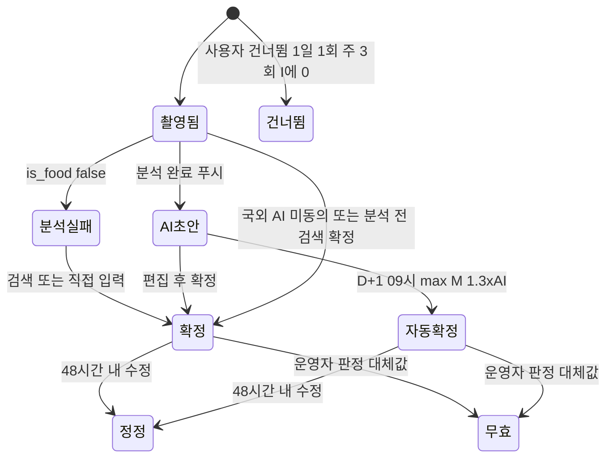

# 04. 칼로리 엔진 및 순위 규칙 — 챌로리 (Challory)

작성일: 2026-10-01 | 근거: `02-설계-결정-기록.md` 5~7장, `01-유사앱-조사.md` 5·8장 | 구현: SQL 함수 1개(`/simulate`) + 집계 Edge Function

> 결정 기록의 값은 그대로 따르고, 결정에 없는 세부는 조사 보고서 근거로 채워 **[제안]** 표시. 모든 kcal은 추정치이며 의료 조언이 아니다.

## 1. 기호·단위 정의

| 기호 | 의미 | 값 / 단위 |
|---|---|---|
| p, d | 참가자, 챌린지 일(Asia/Seoul 자정) | — |
| W, H, Y, sex | 체중 kg·키 cm·만 나이·성별, 시작 시 잠금 | BMI 15~45 밖 재확인 |
| BMR_p | 기초대사량(Mifflin-St Jeor), **10 kcal 단위 반올림 정수**(2장) | kcal/일 |
| A_d | 순 활동 kcal = 걸음 net + 세션 net + 층수 보너스 | 상한 C=**1,000**(=2T) |
| I_d | 섭취 kcal = Σ 확정 끼니(≥150) + Σ 간식(<150) + 미기록 주식 슬롯 대체값 M_p(4.3) | M_p=**max(700, 0.45·BMR)** |
| F_p | 섭취 하한 클램프 | **max(1,200, 0.8·BMR)** |
| T | 일일 목표 순적자 | **500** 고정(T∝W는 장부 병기만) |
| D_d, S_d | 일일 순적자 kcal, 일일 점수 | S_d 0~150점 |
| MET | 1 MET ≈ 1 kcal/kg/h, 2024 Compendium 코드 저장 | — |
| steps_out, floors_d | 세션 창 밖 걸음, 층수 | 상한 30,000보 / 50층 |

[제안] 저장은 kcal·점수 소수 1자리(half-up), 순위 비교는 저장된 S_d로 하여 동점 정의를 고정. 단 BMR_p는 2장 규칙대로 **10 kcal 단위 정수**로 저장하고, M_p·F_p·D_d는 그 반올림된 BMR_p로 계산한다(원값 소수는 산식에 쓰지 않음).

## 2. BMR 계산과 갱신 규칙

```
BMR_raw = 10·W + 6.25·H − 5·Y + s,  s = +5 (남) / −161 (여)
BMR_p   = round10(BMR_raw)     # 10 kcal 단위 half-up: 1,648.75 → 1,650 / 1,287.75 → 1,290 / 1,645.0 → 1,650
```

| 규칙 | 내용 |
|---|---|
| 입력 | P2 4항목, 만 나이는 시작일 기준. BMI<15·>45 재확인 모달 |
| 반올림 | [제안] BMR_raw를 **10 kcal 단위 half-up** 정수로 저장(05 profiles.bmr_kcal·participants.bmr_locked는 integer). 산식의 BMR_p·M_p·F_p는 모두 이 값에서 계산 → 결정 기록 예시(1,650·1,290)·골든 G1·G2(28.8·72.1)와 일치. 원값으로 계산하면 28.6·71.7이 되어 골든 실패 |
| 잠금 | 시작 시 잠금(+10 kg ≈ +28점/일 억제). 변경은 운영자 문의 |
| 운영자 정정 | [제안] 승인 다음 날 00:00부터 새 W·BMR 적용, 과거 재계산 없음, P10 이력 |
| 건강앱 체중 | bodyMass/WeightRecord는 표시용, **산식 미반영** [제안] |
| 기록 모드 | 만 19세 미만(시작일 기준, 02 §3-2)·BMI<18.5·임신/수유·섭식장애 병력은 점수 계산하되 순위 제외 |

## 3. 소비 칼로리 엔진

### 3.1 데이터 소스

| 지표 | HealthKit | Health Connect | 용도 |
|---|---|---|---|
| 걸음 | stepCount | StepsRecord | 순위(1일 집계) |
| 층수 | flightsClimbed | FloorsClimbedRecord | 보너스(있을 때만) |
| 세션 | HKWorkout running/stairClimbing/walking | ExerciseSessionRecord 56/68/79 | 순위 |
| 활동 kcal | activeEnergyBurned | ActiveCaloriesBurnedRecord | P8 참고값만 |
| 수동 여부 | WasUserEntered, HKSource | recordingMethod, dataOrigin | 수동 제외·출처 저장 |

- 수동 입력(MANUAL_ENTRY, WasUserEntered=true)은 집계 전 제외. 걸음은 1일 집계만 쓴다. iOS는 HKStatisticsCollectionQuery에 WasUserEntered≠true predicate를 걸어 수동 걸음을 집계 단계에서 차감(steps_total − steps_manual = 검증 걸음, P8 "검증/기록/미인정") [제안]; Android aggregate는 recordingMethod 필터가 없어 수동 출처 감지 시 숫자 대신 플래그(7장 #2)·P8 "검토 중". 벤더 API는 v1 제외.
- [제안] 출처 화이트리스트 초기값: Apple Health, 삼성헬스, HC 네이티브, Garmin·Fitbit·Zepp·Xiaomi. 실기기 검증 후 갱신.

### 3.2 걸음 → MET → net kcal

v1은 **고정 MET 3.8**(코드 17190) 전원 적용(케이던스 가변 MET는 v2). 100 spm ≈ 6,000보/h, net kcal/h = (MET−1)·W → **1보 = (3.8−1)·W/6,000 kcal**(70 kg = 0.0327). 거리·케이던스는 검증·v2 버킷용으로 저장만.

```
function steps_net(p, d):
    total   = platform_daily_steps(p, d)                 # iOS: 수동 제외 집계값(steps_total − steps_manual), Android: 플랫폼 합계. 원시 샘플 합산 금지
    in_sess = Σ platform_steps_in_range(s.start, s.end)  # 3.3의 달리기·계단 세션
    out     = min(max(0, total − in_sess), 30000)
    return out × (3.8 − 1) × W_p / 6000
```

### 3.3 운동 세션 처리와 중복 구간 제거

| 유형 | MET | 처리 |
|---|---|---|
| 달리기 | 속도 tier <8 km/h **7.5** / 8~9.6 **8.5** / 9.7~12.8 **9.3** / ≥12.9 **12.0** | net=(MET−1)·W·h, 세션 창 걸음 제외 |
| 계단 세션 | **6.8** | 동일. 겹치는 층수는 3.4에서 차감 [제안] |
| 걷기 세션 | 걸음과 동일 3.8 | 세션 처리 없음(걸음 경로만) |
| 그 외 | — | v1 미인정, P8 "미인정 운동" |

- 자동 기록·화이트리스트 출처만. 자정을 넘는 세션은 일별 분할.
- 폰+워치 동시 기록은 겹치는 구간을 **1건으로 병합**, MET는 긴 세션 기준 [제안]. 거리 없는 달리기는 7.5, 5분 미만·6시간 초과·>25 km/h는 값 유지+플래그 [제안].

### 3.4 계단 보너스

```
floors_bonus = min(floors_d, 50) × (6.8 − 1) × W_p × 17.5 / 3600    # 70 kg ≈ 2.0 kcal/층, 최대 ≈ 100
```

- iOS flightsClimbed·Android FloorsClimbedRecord가 있을 때만 적용, 출처 저장. 없음(Galaxy 폰 단독 대다수)은 0이며 층수 항목 **숨김**(0 노출 금지). 기압계 자체 산출은 v2.
- 층당 17.5 s는 15~20 s 가정의 중간값(근거 약함) → 엔진 상수. [제안] 계단 세션 창과 겹치는 층수는 차감.

### 3.5 활동 칼로리 상한 C_p

- 전원 **C=1,000**. 걸음 30,000보·층수 50층 상한을 먼저, A_d 합계에 1회 적용. 상한 도달은 플래그 아님. 3일 연속 A_raw>1,000은 건강 신호(8장).
- P8 게이지 = min(A_d,C)/C, 초과분 "상한 초과 nnn kcal 미반영".

### 3.6 하루 집계 규칙


| 항목 | 규칙 |
|---|---|
| 자정 경계 | 전원 **Asia/Seoul 00:00** 버킷(해외 체류자도 [제안]). 쿼리 anchor = KST 자정 |
| 쿼리 | iOS HKStatisticsCollectionQuery(cumulativeSum, 1일), Android aggregateGroupByPeriod(1일). 원시 합산 금지 |
| 다중 소스 | 한 사람의 폰+워치 중복은 플랫폼 병합 결과 신뢰. 출처별 분리 시 [제안] 워치 앱 > 삼성헬스 > HC 네이티브 중 **하나만**, 선택 출처 저장 |
| 재조회 | 동기화마다 D·D−1·D−2 upsert. 확정 뒤 도착한 값은 late_delta 기록만, 자동 반영 없음 [제안] |

## 4. 섭취 칼로리 엔진

### 4.1 사진 → LLM JSON 스키마

Gemini 2.5 Flash(Vertex AI) 1차 + Claude Haiku 4.5 어댑터. 긴 변 ≤1,568 px·EXIF 제거. LLM은 음식명 후보·개수·분량 구간까지, kcal은 4.2 DB.

| 필드 | 타입 | 정의 |
|---|---|---|
| is_food | bool | false → P6 검색 폴백, null → 분석 실패 |
| items[] | array ≤8 [제안] | 음식·반찬 단위 |
| .name_candidates | string[3] | 한국어 표준 음식명 top-3(확신 순) |
| .count | int ≥1 | 개수 음식(만두·김밥) 개수 |
| .portion_bucket | half/one/large | 1인분 대비 0.5/1.0/1.5 [제안] |
| .has_broth | bool | 국·찌개·탕 → 국물 토글 노출 |
| .confidence | high/mid/low | 자체 보고(미보정) → 배지 확실/확인 필요 |

프롬프트 [제안]: 한식 분류 체계 제시, "kcal·g 숫자 출력 금지" 지시, JSON 스키마 강제, 실패 1회 재시도, 타임아웃 8초.

### 4.2 음식명 → 식약처 DB 매핑

- DB: 음식 표준데이터(15100070) 사전 적재, servSize·kcal. 28만 건 DB는 v2.
- 흐름: 후보 3개 → 동의어 100개 정규화(곰탕≈설렁탕) → pg_trgm → 최고 유사도 **≥0.45 자동 매칭 / 0.25~0.45 후보 칩 3개 / <0.25 미매칭** [제안 임계].
- **kcal = DB 1인분 × 분량 배수 × 개수 × 국물 계수**. 밥류 반 공기 0.5 / 1공기 1.0 / 곱빼기 1.5. 국물 안 먹음 **×0.6**. 반찬 1젓가락 ×0.15, 개수 음식은 1인분/표준 개수 환산 테이블 [제안]. P7 분량 슬라이더(0.5~2.0, step 0.25)는 portion_multiplier로 저장하고 portion_bucket(half/one/large)은 AI 초안·칩 초기값만(05 meal_items) [제안].
- 미매칭: 같은 분류 1인분 중앙값 임시값 + "확인 필요" 배지 [제안]. 실패 로그로 동의어 주 1회 보강.

### 4.3 사용자 확정 규칙(자동값 / 확정값 분리)



상태 ↔ 05 meals.status: 촬영됨 captured · AI초안 draft · 분석실패 failed · 확정 confirmed · 자동확정 auto · 정정 corrected · 무효 void · 건너뜀 skipped(03 §9와 1:1)

| 규칙 | 내용 |
|---|---|
| 저장 | ai_kcal, confirmed_kcal, delta_ratio, status, items 분리. 순위·링은 confirmed_kcal만 |
| 끼니/간식 | 확정 **≥150 kcal → 끼니**(주식 슬롯 충족), **<150 → 간식**(슬롯 미충족, 대체 없음) |
| 슬롯 태그 | 서버 수신 KST 기준(예외: 지연 업로드 — 단말 촬영 시각과 30분 초과~12h 차이면 단말 시각으로 태그 + late_upload 플래그, 단말 날짜가 is_final이면 끼니 미인정; 03 F-MEAL-01·05 §6) 아침 04:00~10:30 / 점심 ~15:00 / 저녁 ~**22:00** / 그 외 간식 [제안](03 F-MEAL-01·06 P6와 동일 값). 경계값은 challenge_rules에 저장해 P6 자동 태그·배치·P11 상수 블록이 같은 값을 읽음 [제안]. 변경 가능, 한 슬롯 2끼는 합산 |
| I_d | Σ 확정 끼니(≥150) + Σ 간식(<150) + 빈 주식 슬롯 수 × M_p. 간식은 슬롯만 못 채우고 kcal은 합산해 "끼니를 간식으로 분할 촬영" 차단(결정 5·9장 채택). 예 3·T09·T24가 이 규칙 기준 |
| 미확정 초안 | D+1 09:00 배치에서 **max(M_p, 1.3×ai_kcal)** 자동 확정(status=auto). 48시간 내 수정은 정정, 이후 잠금 [제안] |
| 잠정 계산 | [제안] 매시 잠정(5.4)에서 status=draft 끼니는 ai_kcal 자체가 아닌 **max(M_p, 1.3×ai_kcal)** 를 대체값으로 넣고 그 값으로 is_main 판정(항상 ≥M_p라 슬롯 충족). captured·failed(ai_kcal 없음)는 빈 슬롯과 같이 M_p. 09:00 자동 확정값과 같으므로 확정 시 점수 하락 '놀람' 없음(U-12). breakdown에 draft_slots·draft_kcal 기록, P5 캡션 "점심 미확정 → 1,105 kcal로 잠정 계산 중 · 확정하면 반영" |
| 건너뜀 | 0 kcal, 1일 1회·주 3회. 초과분 M_p. 반복+상위 30% 플래그 |
| 하향 수정 | ai 대비 −50% 초과 → 확인 모달+플래그, 값 유지 |
| 0끼 예외 | 끼니 0개인 날 **S_d=0** |
| 무효 판정 | 끼니 → M_p 대체, 간식은 삭제 |

### 4.4 바코드 / 검색 / 텍스트 폴백

- v1 포함: **식약처 검색**(검색 → 1인분 → 배수, 국외 AI 미동의자 기본 경로), **최근 음식**(30일 확정 20개 [제안]), **직접 입력**(배지 "직접 입력", 1일 3건 이상 플래그 [제안]).
- v2: 바코드·라벨 OCR·음성. 갤러리 업로드는 **금지**(인앱 카메라 전용, 서버 시각·SHA-256).

### 4.5 섭취 하한 F_p

**F_p=max(1,200, 0.8·BMR_p)**. 산식에 max(I_d, F_p)로 들어가 굶기가 점수를 올리지 못한다. 건강 넛지 임계(남 1,500/여 1,200)는 산식과 분리(8장): 성별 고정 하한을 산식에 넣으면 55 kg 남성(BMR 1,436)에서 F=1,500>BMR 비대칭이 생기므로 넛지 임계로만 쓴다(결정 9장). 채택 산식에서 F_p>BMR_p가 되는 경우는 BMR_p<1,200(소형 참가자)뿐이며, 이 처리와 성별 상향 여부는 1회차 뒤 재결정(결정 10-4).

## 5. 순위 산식

### 5.1 정의

```
D_d = (BMR_p + min(A_d, C)) − max(I_d, F_p)
S_d = 100 × clamp(D_d / T, 0, 1.5)        → 0~150점
예외: 150 kcal 이상 확정 끼니 0개 → S_d = 0
누적 Score_p = Σ_d S_d  (첫 3일 점검 기간 제외)
```

### 5.2 기본값(챌린지 공통, 시작 후 잠금)

| 상수 | 값 | 운영자 조정 |
|---|---|---|
| T / C | 500 / 1,000 kcal | 불가(v1) |
| M_p / F_p | max(700, 0.45·BMR) / max(1,200, 0.8·BMR) | 미결(결정 10장) |
| 끼니 임계 / 건너뜀 | 150 kcal / 1일 1회·주 3회 | 불가 / 미결 |
| 걸음·층수·점수 상한 | 30,000보 · 50층 · 150점 | 불가 |
| 확정 시각 / 기준선 | D+1 09:00 KST / 첫 3일(누적 미반영) | 불가 |

### 5.3 성실도 가중 w_d

결정 9장에서 **기각**: 1끼 600 kcal만 확정해도 w_d=0.5로 62.4점 > 정직 기록 28.8점. v1은 **w_d≡1**. 성실도는 (1) 대체값 M_p, (2) 0끼=0점, (3) P5·P9 "반영률 4칸 칩"(아침·점심·저녁 확정+활동 동기화, 표시 전용)으로 처리.

### 5.4 잠정 / 확정 타이밍

| 시점 | 처리 |
|---|---|
| 매시 정각(pg_cron) | D·D−1·D−2 재계산, is_final=false. 초안·미촬영 슬롯은 4.3 '잠정 계산' 대체값으로 산입. P9 "오늘(잠정)" |
| D+1 09:00 KST | 미확정 자동 확정 → S_d → is_final=true. 09:30 푸시 |
| 확정 후 | 사용자 48h 수정·운영자 판정 = **정정**: 새 S_d·사유를 장부 이력에, 누적 차액 반영 [제안] |
| 검토 중 | 잠정 유지, 타인에게 "집계 중". 판정 시 정정 |
| 종료 | 마지막 날 확정 + 7일 이의 기간, '미결 0건'이어야 OP4 최종 확정 |

### 5.5 동점 처리

누적 Score_p(소수 1자리) 동일 → **공동 순위**, 다음 순위는 인원수만큼 건너뜀(1-2-2-4) [제안]. 표시 순서만 확정 끼니 수 → 닉네임 [제안].

### 5.6 주간 / 전체 집계

| 집계 | 산식 | 상태 |
|---|---|---|
| 누적 | Σ S_d **합계**. 결측일=0점이라 합계가 "미기록은 손해"와 일치, 평균은 결석을 보상 | v1 |
| 주간 | 월~일 Σ S_d, 월요일 00:00 리셋 | v1.1 보류 |
| 일평균 / 중도 참가 | P10 장부 병기만 / 시작 후 합류는 초대코드 만료로 차단 | [제안] |

### 5.7 팀전 옵션(v1.1)

[제안] 팀 점수 = Σ 팀원 S_d / 팀원 수(1인당 평균). 순위 제외자는 분모에서도 제외. 개인 점수 독립 노출, 팀 보상은 기간 평균 S≥60 달성자에게만.

## 6. 예시 계산

공통 T 500, C 1,000. 예 1·2는 결정 기록, 예 3·4는 검증·신규.

| 단계 | 예1 폰만 70 kg 남 175/30 | 예2 워치 58 kg 여 163/30 | 예3 미기록(예1 인물) | 예4 과다 활동 75 kg 남 180/30 |
|---|---|---|---|---|
| BMR | 1,648.75 → round10 **1,650** | 1,287.75 → round10 **1,290** | 1,650 | 750+1,125−150+5 = **1,730**(반올림 불변) |
| 세션 | 없음 | 달리기 30분 4.5 km, 9 km/h, MET 8.5: 7.5×58×0.5 = **217.5** | 없음 | 달리기 60분 11 km, MET 9.3: 8.3×75×1 = **622.5** |
| steps_out | 9,000 | 12,000 − 세션 창 4,500 = 7,500 | 9,000 | 41,000 − 9,000 = 32,000 → 상한 **30,000** |
| 걸음 net | 2.8×70/6,000 = 0.0327/보 → **294** | 0.0271/보 → **203.0** | 294 | 0.035/보 → **1,050** |
| 층수 | 없음(카드 숨김) | 없음 | 없음 | 72 → 50층 × 5.8×75×17.5/3,600 = **105.7** |
| A_raw → A_d | 294 | 420.5 | 294 | 1,778.2 → **1,000** |
| 끼니 | 3끼 확정 1,800 | 3끼 확정 1,350(워치 kcal 380은 참고값) | 저녁 600 확정, 간식 커피 100 확정, 점심 AI 850 미확정, 아침 미촬영 | 3끼 2,100 |
| 대체·자동확정 | — | — | M=742.5; 점심 max(742.5, 1,105)=**1,105**; 아침 742.5 | — |
| I_d / F_p | 1,800 / 1,320 | 1,350 / 1,200 | 600+100+1,105+742.5 = **2,547.5** / 1,320 | 2,100 / 1,384 |
| D_d | 1,650+294−1,800 = **144** | 1,290+420.5−1,350 = **360.5** | 1,650+294−2,547.5 = **−603.5** | 1,730+1,000−2,100 = **630** |
| S_d | **28.8** | **72.1**(워치 유무 무관 동일 공식) | clamp → **0.0**(커피 100은 간식: I_d에 합산되나 슬롯 미충족 → 끼니 1개. 잠정도 같은 값) | 100×1.26 = **126.0**, 걸음 41,000>25,000 → **검토 중** |

## 7. 이상치·부정 탐지 규칙

원칙: 자동 차단·공개 지목 없음. 플래그 → **검토 중**(잠정 점수 유지, 타인에게 "집계 중") → 인앱 소명 1회(72h) → 운영자 판정(SLA 72h) 승인 / 경고 / 무효 / 순위 제외(경고 3회). 판정은 사유 템플릿·당사자 푸시·감사 로그, 정정으로 장부 기록.

| # | 조건 | 코드(05 reviews.type) | 상태 | 무효 시 처리 |
|---|---|---|---|---|
| 1 | 걸음 >25,000 **또는** 개인 중앙값×2.5(첫 3일 기준) | steps_spike | 검토 중 | 걸음 net을 중앙값 기준으로 대체 |
| 2 | 걸음·세션 출처가 화이트리스트 밖 | source_unknown | 검토 중 | 해당 출처 레코드 제외 |
| 3 | 사진 SHA-256 중복(본인·타인) | dup_photo | 검토 중 | 끼니 → M_p |
| 4 | confirmed < 0.5×ai_kcal | downward_edit | 검토 중 | ai_kcal 복원 |
| 5 | 건너뜀 주 3회 초과 또는 반복+누적 상위 30% | skip_abuse | 검토 중 | 초과분 자동 M_p, 판정은 경고 |
| 6 | 세션 5분 미만·6시간 초과·>25 km/h [제안] | session_anomaly | 플래그 | 값 유지, 운영자 확인 |
| 7 | 직접 입력 1일 3건 이상 [제안] | manual_input_burst | 플래그 | 값 유지 |
| 8 | 동일 기기 식별자 계정 2개 이상 [제안] | multi_device | 검토 중 | 운영자 판정 |
| 9 | 지연 업로드: 단말 촬영 시각과 30분 초과 차이(03 F-MEAL-01) [제안] | late_upload | 플래그 | 값 유지, 운영자 확인(is_final 날짜는 끼니 미인정) |
| 10 | 서명 PUT 뒤 sha256·bytes·해상도 재검증 불일치(05 §6) [제안] | photo_mismatch | 플래그 | 업로드 422 거부, 반복 시 운영자 확인 |

## 8. 안전 규칙

| 구분 | 규칙 | 노출 |
|---|---|---|
| 자격 | 만 14세 미만 가입 차단; 만 14~18세(만 19세 미만)는 참가 허용·기록 모드(02 §3-2) | P2 |
| 기록 모드 | 만 19세 미만·BMI<18.5·임신/수유·섭식장애 병력 → 점수 표시, 순위 제외, 사유·명단 비공개 | P2·P9 |
| 하한 경고 | ① 당일 확정 섭취(대체값 제외) < 넛지 임계(남 1,500/여 1,200, challenge_rules nudge_min_m/f) → P5 인라인 안내만(푸시 없음) / ② 3일 연속 → N-07 푸시 + OP2 건강 알림 비공개 섹션(health_alerts low_intake_3d) — 03 F-FAIR-01·§8 2단 구조 | P5·OP2 |
| 과도 활동 | A_raw>1,000 3일 연속 → OP2 비공개 알림+넛지(검토 큐 아님) | OP2 |
| 감량률 | 체중 기록 시 주 −1% 초과 경고, −2% 초과 OP2 알림, 순위 영향 없음 [제안: HealthyWage 2%] | OP2 |
| 표기 | "추정치"·"의료 조언 아님" 상시, '실패' 등 수치심 카피 금지, 사진 비공개·종료+7일 파기 | 전 화면 |

## 9. 테스트 케이스(엔진 단위 테스트)

G1~G3은 `/simulate` 골든 회귀, 허용 오차 ±0.05점.

| ID | 영역 | 입력 → 기대 |
|---|---|---|
| G1 | 전체 | 예1 → S=28.8 |
| G2 | 전체 | 예2 → S=72.1 |
| G3 | 하한 | 예3 → S=0.0 |
| T01 | BMR | 남 70/175/30 → raw 1,648.75 → 저장 **1,650**; 여 58/163/30 → 1,287.75 → **1,290**; raw 1,645.0 → 1,650(half-up 경계) |
| T02 | 걸음 | 35,000보 70 kg → steps_out 30,000, net 980.0 |
| T03 | 세션 | 30분 4.8 km → MET 8.5; 4.85 km → 9.3(경계) |
| T04 | 세션 | 걷기 세션 40분 → 세션 net 0, 걸음 차감 없음 |
| T05 | 세션 | MANUAL_ENTRY 달리기 → 제외, 차감 없음 |
| T06 | 세션 | 폰·워치 겹치는 달리기 2건 → 긴 세션 1건으로 병합(is_counted=true), 짧은 행은 is_counted=false·merged_into_id=긴 세션 id, sessions_net_kcal은 1건분, 세션 창 걸음 1회 차감(05 activity_sessions) |
| T07 | 층수 | 72층 75 kg → 105.7; 레코드 없음 → 0+카드 숨김 |
| T08 | 상한 | A_raw 1,778.2 → A_d 1,000 |
| T09 | 섭취 | 끼니 600+간식 100+빈 슬롯 2(BMR 1,650) → I=2,185, 끼니 1개 |
| T10 | 섭취 | 149 kcal 3건 → 끼니 0개 → S=0; 150 kcal 1건 → 끼니 1개 |
| T11 | 자동확정 | AI 850 → 1,105; AI 400 → 742.5 |
| T12 | 건너뜀 | 주 4회째 → M_p 적용+플래그 |
| T13 | 하향수정 | AI 800 → 390 확정 → 플래그, 값 유지 |
| T14 | 클램프 | D=900 → 150.0; D=−10 → 0.0 |
| T15 | 매핑 | "설렁탕" → 곰탕 코드; 유사도 0.3 → 후보 칩, 자동 매칭 없음 |
| T16 | 매핑 | 밥 곱빼기 + 찌개 국물 안 먹음 → ×1.5, ×0.6 |
| T17 | 집계 | KST 00:00 경계 걸음 → 전날·당일 분리(UTC 15:00) |
| T18 | 확정 | 09:00 이후 도착 걸음 → late_delta, S 불변 |
| T19 | 정정 | 확정 후 47h 수정 → 정정+누적 차액; 49h → 거부 |
| T20 | 동점 | 누적 123.4 두 명 → 공동 1위, 다음 3위 |
| T21 | 플래그 | 걸음 26,000 → 검토 중, 잠정 유지 |
| T22 | 운영자 정정 | 체중 70→65 승인 → 다음 날부터 적용, 과거 불변 |
| T23 | 잠정 | 점심 초안 AI 850(그 외 확정) → 잠정 I에 1,105 산입·is_main 1 → 09:00 자동 확정 후 S 불변; 사용자 780 확정 → I −325 |
| T24 | 간식 합산 | 예1 + 간식 커피 100 확정 → I=1,900, D=44, S=8.8(간식은 I_d 합산·슬롯 미충족, 끼니 3개) |
