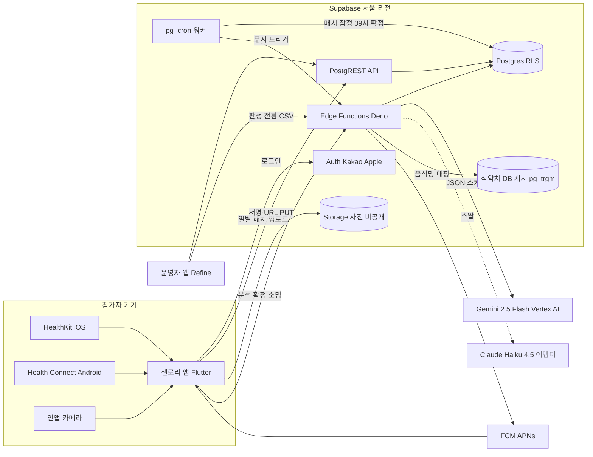
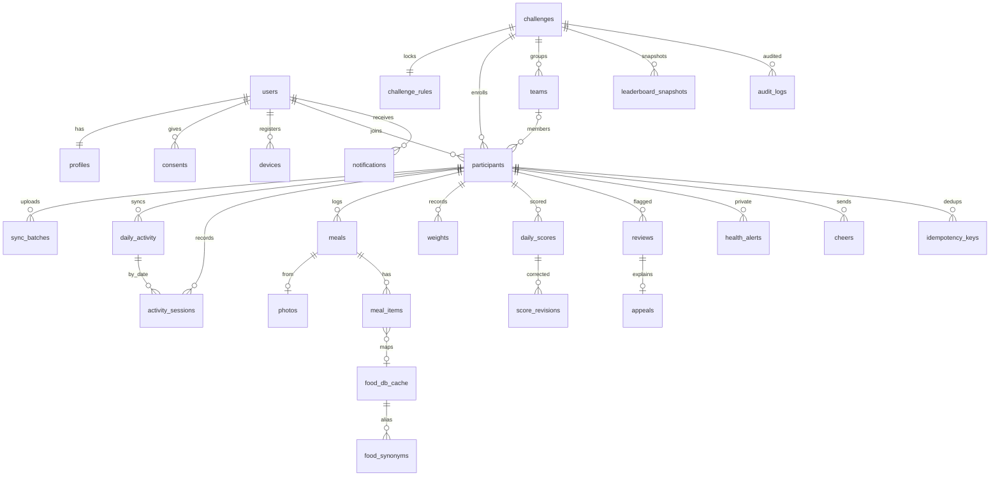
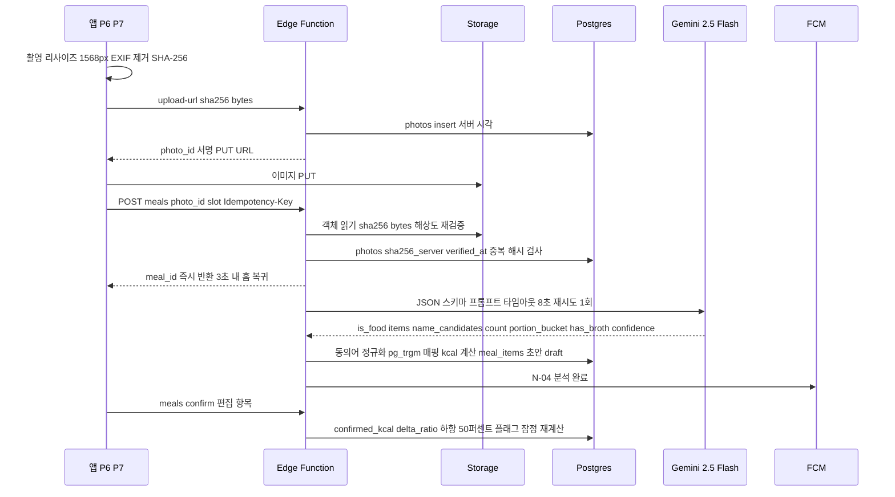
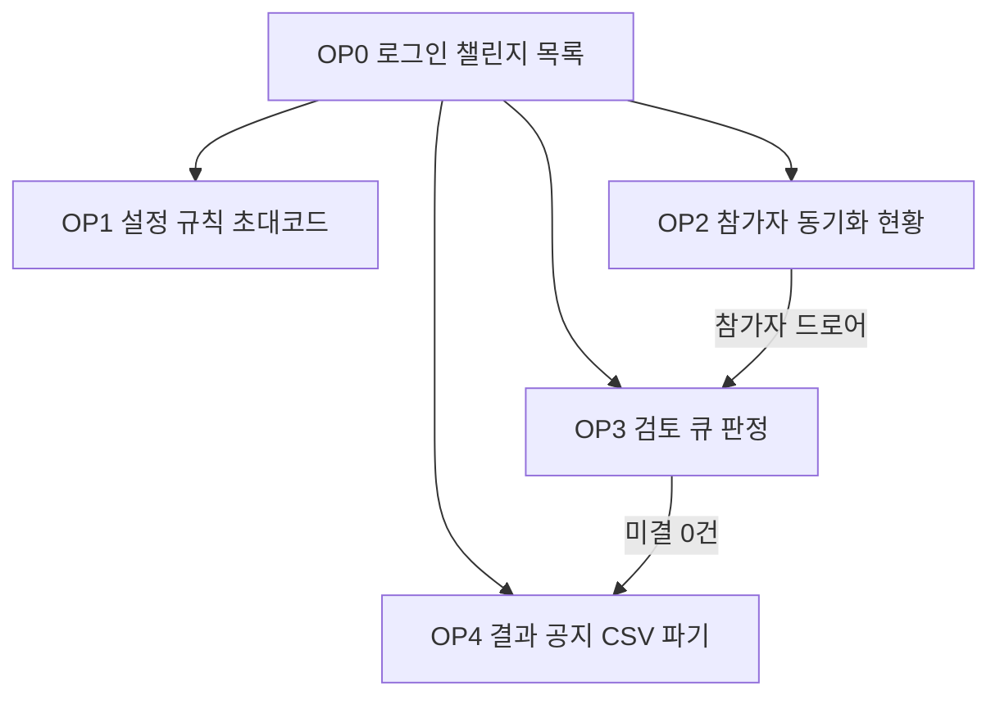

# 05. 데이터 모델 및 아키텍처 — 챌로리 (Challory)

작성일: 2026-10-01 | 근거: `02-설계-결정-기록.md`(결정 그대로 적용), `01-유사앱-조사.md` 5·8장, `03-기능정의서.md`, `04-칼로리-엔진-및-순위-규칙.md` | 결정에 없는 세부는 **[제안]**. 참가자 데이터는 전부 `challenge_id`가 1급 키.

---

## 1. 아키텍처 개요

원칙: (1) 앱은 HealthKit·Health Connect만 읽고 **1일 집계값·세션·출처**를 올리며 kcal 계산은 서버가 한다 **[제안]**. (2) 점수는 SQL 함수 `score_simulate` 1개가 계산하고 P5·P11·OP1·확정 배치가 공유한다. 걸음·세션·층수→A_d 변환도 SQL 함수 `activity_kcal` 1개가 맡아 동기화 처리·시뮬레이터·확정 배치가 같은 코드를 호출한다 **[제안]**(§7). (3) ai_kcal과 confirmed_kcal은 분리 저장, 순위는 확정값만. (4) F: 쓰기 요청은 전부 멱등(`Idempotency-Key`, §4) **[제안]**.



service_role 키는 Edge Functions·pg_cron만 쓰고 앱·콘솔은 RLS가 걸린 PostgREST를 쓴다. 식약처 API는 사전 적재 캐시만 쓴다(429 회피).

## 2. 기술 스택

| 영역 | 선택(02 §8) | 이유 | 대안 |
|---|---|---|---|
| 클라이언트 | Flutter 3.x + `health` 13.x, `camera` 인앱 전용 | HK+HC 단일 패키지, 유지보수 활발 | React Native(iOS 패키지 동결) |
| 백엔드 | Supabase: Postgres·Auth·Storage·Edge Functions·pg_cron·RLS | 2명·6주에 운영 최소, SQL 함수 단일 구현, RLS 챌린지 격리 | Firebase(SQL 집계 불리) |
| 점수 엔진 | Postgres 함수 `score_simulate` | 화면·배치 동일 코드, 골든 테스트 3건 | 앱 내 계산(불일치) |
| AI | Gemini 2.5 Flash(Vertex AI, 서울 리전 우선) + Claude Haiku 4.5 어댑터 | 장당 ≈1.4원, JSON 스키마 | FoodLens(가격 비공개, v2 A/B) |
| 영양 DB | 식약처 15100070 적재 + pg_trgm + 동의어 100개 | 1인분 기준이라 배수 산식과 일치 | 28만 건 DB(v2) |
| 푸시 | FCM(APNs), pg_cron → Edge Function | 단일 SDK, 무료 | — |
| 콘솔 | Refine(React) + Supabase | CRUD 표 생산성, 같은 RLS | Supabase Studio+SQL 뷰(1회차 허용) |
| 배포 | TestFlight 선행, Play Health apps 선언 1주차, Crashlytics(건강 수치 미전송) | 심사 리드타임 흡수 | — |
| 이미지·CI **[제안]** | 기기 리사이즈·EXIF 제거 후 서버 재검증, Supabase CLI 마이그레이션 + GitHub Actions 골든 테스트 | Deno 이미지 제약 회피, 산식 변경 게이트 | 서버 리사이즈 |
| 네이티브 모듈 **[제안·필수]** | `health` 13.x가 노출하지 않는 기능은 MethodChannel 네이티브 2종으로 보강 — iOS Swift: `enableBackgroundDelivery(stepCount, .hourly)`+`HKObserverQuery`를 AppDelegate 기동 시 등록, `HKStatisticsCollectionQuery(.cumulativeSum, .separateBySource)`+`WasUserEntered≠true` predicate로 걸음·거리·층수 1일 집계·출처별 합계·세션 창 걸음; Android Kotlin: `HealthConnectClient.aggregateGroupByPeriod`(STEPS/DISTANCE/FLOORS TOTAL)+`dataOrigins`, 세션 창 `aggregate(TimeRangeFilter)`로 steps_in_range, `readRecords`는 MANUAL_ENTRY 식별용만 / 카메라 보강(06 P6 [제안]): 볼륨 키 촬영 — iOS 17.2+ `AVCaptureEventInteraction`, Android `KeyEvent.KEYCODE_VOLUME_UP/DOWN` 가로채기, MethodChannel 3번째 모듈, 미지원 버전은 기능 미노출(App Store 2.5.9) | 패키지 공개 API는 `getTotalStepsInInterval`(걸음 합계)·원시 레코드 조회 중심이라 §5 배치 포맷(floors·sources[]·steps_in_range)과 '원시 합산 금지'를 단독으로 충족하지 못함(pub.dev 13.3.2 README 기준, S2 실기기에서 재확인) | 원시 레코드 업로드 후 서버 합산(폰+워치 중복 병합 명세 필요) |

## 3. 데이터 모델(ERD)



공통 `id uuid PK`, `created_at`, `updated_at`. 참가자 범위 테이블은 `challenge_id`·`participant_id`를 갖고 RLS는 `user_id = auth.uid()` 또는 `challenges.operator_id = auth.uid()`.

| 테이블 | 핵심 컬럼 | 키·비고 |
|---|---|---|
| users | id(=auth.users), provider, nickname, status | 1인 1계정, 삭제 시 익명화 |
| profiles | user_id PK, sex, birth_year, height_cm, weight_kg, bmr_kcal integer generated(04 §2 round10: BMR_raw를 10 kcal 단위 half-up), record_mode, record_mode_reason minor/bmi/pregnancy/eating_disorder(암호화) | 시작 후 변경 트리거 거부 |
| consents | user_id, type terms/sensitive_health/overseas_ai, version, granted_at, revoked_at | 3분리 동의 |
| devices | user_id, platform, push_token, push_permission granted/denied/not_asked(06 흐름 2; N-02·N-04는 granted·push_token 있을 때만 발송), app_version, integrity_verdict null | 무결성은 nullable 예약 |
| challenges | name, status(8종), start_date, end_date, capacity, invite_code char(6) UNIQUE, rules_md, operator_id, photos_purged_at | 전환은 03 §7 상태도만 |
| challenge_rules | challenge_id PK, t 500, c 1000, m_min 700, m_ratio 0.45, f_min 1200, f_ratio 0.8, nudge_min_m 1500·nudge_min_f 1200(건강 넛지 임계, F_p와 별개, 03 F-FAIR-01·04 §8), snack 150, steps_cap 30000, floors_cap 50, step_met 3.8, broth 0.6, skip 1/일·3/주, check_days 3, slot 경계 breakfast_start 04:00·breakfast_end 10:30·lunch_end 15:00·dinner_end 22:00(04 §4.3), late_upload_window 12h **[제안]**, locked_at | Checking 진입 시 잠금. 참가자 SELECT RLS(P11 상수 블록·P6 자동 태그) |
| participants | challenge_id, user_id, nickname, sex, age, height_cm, weight_locked, bmr_locked integer(round10, 04 §2), status(active/record_mode/excluded/kicked/left), rank_eligible(false: status record_mode·warning_count≥3·kicked; record_mode 조건 = 만 19세 미만(시작일 기준, 연도 수집이라 12/31생 보수 판정)·BMI<18.5·임신/수유·섭식장애, 02 §3-2), warning_count, baseline_median_steps, grade_badge, grade_badge_public bool default false, leaderboard_visible bool default true(opt-out), block_rejoin, operator_note text, team_id | UNIQUE(challenge_id,user_id), 프로필 잠금. operator_note는 운영자 RLS 전용·CSV 미포함(03 F-SET-01·F-LB-01·O-05) |
| teams | challenge_id, name | v1.1 예약 |
| sync_batches | participant_id, device_id, client_batch_id UNIQUE, result jsonb | 멱등성 키 |
| idempotency_keys **[제안]** | participant_id, key uuid, endpoint, request_hash, status_code, response jsonb | UNIQUE(participant_id, key). F: 쓰기 공통 멱등(§4 규약), 7일 후 삭제 |
| daily_activity | participant_id, local_date, steps_total, steps_manual(null=미지원), steps_in_sessions, distance_m, floors, platform_active_kcal(참고), sources jsonb, steps_net_kcal, sessions_net_kcal, floors_kcal, a_raw, a_capped, late_delta | UNIQUE(participant_id,local_date) |
| activity_sessions | participant_id, local_date(자정 분할 일자), platform_uid, type running/stair/walking, start_at, end_at(분할 구간), steps_in_range, avg_speed_kmh, met, net_kcal, origin, recording_method, is_counted, merged_into_id(self FK nullable) | UNIQUE(platform_uid, local_date): 자정을 넘는 세션은 일별 2행(04 §3.3). 폰+워치 중복은 긴 세션으로 병합 — 짧은 행 is_counted=false·merged_into_id 기록(04 T06). daily_activity와 (participant_id, local_date)로 연결, sessions_net_kcal = Σ is_counted 행. 자동 기록만 인정 |
| meals | participant_id, local_date, slot, status(captured/draft/failed/confirmed/auto/corrected/void/skipped), photo_id, engine gemini/claude/none, ai_kcal, confirmed_kcal, delta_ratio, is_main(≥150), captured_at(서버), version int, locked_at | local_date·slot은 서버 KST 자동 태그(지연 업로드 예외는 §6). UNIQUE(photo_id) WHERE photo_id IS NOT NULL, UNIQUE(participant_id, local_date, slot) WHERE status='skipped', version은 confirm `If-Match` |
| meal_items | meal_id, name_candidates[3], chosen_name, food_code, input_type ai/search/manual/recent, count, portion_bucket half/one/large(AI 초안·칩 초기값), portion_multiplier numeric(3,2) NOT NULL(기본 0.5/1.0/1.5, 06 P7 슬라이더 0.5~2.0 step 0.25 저장), broth_off, bite_fraction(반찬 1젓가락 0.15), eaten, confidence, match_score, ai_kcal, confirmed_kcal | kcal = 1인분 × portion_multiplier × count × (broth_off ? 0.6 : 1) × bite_fraction |
| food_db_cache | food_code PK(15100070), name_kr, category, serving_g, kcal, carb_g, protein_g, fat_g | GIN trgm 인덱스 |
| food_synonyms | alias, food_code, weight | 곰탕≈설렁탕 100개 |
| photos | participant_id, storage_path, sha256(클라이언트 보고), width, height, bytes, client_captured_at(기기 시각·참고), server_received_at, sha256_server, verified_at, purged_at | 중복 검사는 sha256_server 기준(§6 재검증 뒤), 파기 후 해시·메타만 |
| weights | participant_id, local_date, weight_kg, source manual/health_app | 순위 미사용, 경고만. R:/weights 본인 RLS(06 흐름 6) |
| daily_scores | participant_id, local_date, bmr, a_d, i_confirmed, i_snack, substitute_slots, m_p, i_d, f_p, d_d, s_d numeric(5,1), main_meal_count, is_counted, is_final, under_review, breakdown jsonb | UNIQUE(participant_id,local_date), P10 원천 |
| score_revisions | daily_score_id, prev_s_d, new_s_d, reason user_edit/verdict/late_sync, review_id, actor_id | 확정 후 변경=정정 |
| leaderboard_snapshots | challenge_id, scope today/cumulative, as_of, is_final, rows jsonb(cheer_count 포함 **[제안]**) | 매시 1건, 09:00 확정 1건 |
| cheers | challenge_id, from_participant_id, to_participant_id, local_date | UNIQUE(from_participant_id, local_date)=보낸 사람 기준 하루 1회(06 P9 카피 전제, 수신자별 아님). RLS 본인 insert·같은 챌린지 참가자 select |
| reviews | participant_id, type enum — 확정 5(04 §7 #1~#5): steps_spike / source_unknown / dup_photo / downward_edit / skip_abuse, **[제안]** 3(#6~#8): session_anomaly / manual_input_burst / multi_device, 그 외 late_upload·photo_mismatch(§6) **[제안]**, report(신고), objection(결과 이의, Published 7일 내 당사자 1회, 03 §7 "Published → Published: 이의 접수") **[제안]**, target, status open/appealed/decided, verdict approve/warn/void/exclude, reason_template, sla_due_at(N-05 발송 시각+72h, 03 §8), score_impact, reporter_id | 신고자 비노출. 02 §7-7·03 F-FAIR-01의 '5종'은 확정분 |
| appeals | review_id UNIQUE, text | 소명 1회·72h |
| health_alerts | participant_id, type low_intake_3d/high_activity_3d/weight_drop, local_date | OP2 비공개 전용 RLS |
| notifications | user_id, type N-01~N-07(03 §8), category transactional/scheduled, payload, scheduled_at, sent_at, read_at | 03 §8 2분류: transactional(N-04·N-06)은 즉시, scheduled(N-01·02·03·05·07)는 22~08시 발송 금지·하루 최대 4건 — 그 시간대 생성분(N-05)은 scheduled_at=다음 08:00. 생명주기 전환은 푸시 없이 P5 상태 칩·N-03 공지로 안내 |
| audit_logs | challenge_id, actor_id, actor_role, action, target, before, after | append-only, 종료+90일 **[제안]** |

## 4. API 설계

`R:`=PostgREST `/rest/v1`(RLS), `F:`=Edge Functions `/functions/v1`. JSON·Bearer JWT, 오류 401/403/409(충돌)/412(`If-Match` 불일치)/422/429. 권한: 본인=참가자 자신, 운영자=챌린지 `operator_id`.

**멱등 규약 [제안]**: 모든 F: 쓰기(POST/PATCH/DELETE)는 `Idempotency-Key` 헤더(클라이언트 UUID) 필수 → `idempotency_keys`에 응답 저장. 같은 키·같은 본문 재전송은 **저장된 응답을 200으로** 반환, 같은 키·다른 본문은 409. 자연키 UNIQUE(meals.photo_id, skipped 슬롯, cheers, client_batch_id)가 2차 방어. R: 직접 쓰기(#5·#18·#32)는 UNIQUE 위반을 PostgREST 409로 받고 앱이 '이미 반영됨'으로 처리.

| # | 메서드 | 경로 | 요청 | 응답 | 권한 |
|---|---|---|---|---|---|
| 1 | POST | /auth/v1/token?grant_type=id_token | Kakao/Apple 토큰 | JWT | 공개 |
| 2 | GET | F:/invite/{code} | 6자리 코드 | 챌린지 요약·규칙 카드 / GET /i/{code}(웹 랜딩 HTML: 챌린지명·코드 큰 글씨·"코드 복사"·스토어 버튼, Universal Links/App Links 연결 경로 — 03 F-ACC-01) **[제안]** | 공개 |
| 3 | POST | F:/join | code, 프로필 4항목, consents | participant, bmr, record_mode | 본인 |
| 4 | PATCH | R:/profiles | 4항목 | profile | 본인(시작 전) |
| 5 | POST | R:/consents, R:/devices | 동의 변경 / push_token | consent / device | 본인 |
| 6 | POST | F:/sync/activity | 5장 배치 | days[], a_d[], 잠정 s_d[] | 본인 |
| 7 | GET | R:/daily_activity, R:/activity_sessions | local_date | 분해·출처·상한·세션 MET(P8) | 본인 |
| 8 | POST | F:/photos/upload-url | sha256, bytes, w, h, client_captured_at, queued bool | photo_id, 서명 PUT URL(10분) | 본인 |
| 9 | POST | F:/meals | photo_id, slot?, local_date?, queued?(§6: local_date·slot 제안값은 queued=true일 때만 수용, 30분/12h/is_final 규칙으로 서버 검증) | meal_id, status captured. overseas_ai 동의자는 engine=gemini 분석 큐 투입, 미동의자는 engine=none → P7 검색 경로 | 본인 |
| 10 | POST | F:/meals/manual | local_date?, slot, items[] | meal, confirmed_kcal | 본인(사진 없는 직접 입력 전용) |
| 11 | GET | R:/meals, R:/meal_items | local_date / meal_id | 슬롯·상태·항목·가정 분량 | 본인 |
| 12 | POST | F:/meals/{id}/confirm | items[](portion_multiplier 포함), `If-Match: version` | confirmed_kcal, delta_ratio, 플래그, 잠정 s_d. 동일 내용 재전송은 revision 미생성 | 본인(locked_at 전) |
| 13 | POST | F:/meals/skip | local_date, slot | skipped 끼니 생성(끼니 없는 빈 슬롯도 가능), 남은 횟수 | 본인 |
| 14 | GET | R:/rpc/food_search | q | 상위 10 + 1인분 kcal | 본인 |
| 15 | GET | R:/daily_scores | 범위 | 장부·is_final·revisions(P10) | 본인 |
| 16 | POST | R:/rpc/score_simulate_from_inputs | bmr·weight(또는 participant_id), steps, sessions[{type, minutes, distance_m}], floors, meals[{kcal}] 또는 i_d | activity_kcal 분해(steps_net_kcal·sessions_net_kcal·floors_kcal·a_raw·a_capped), d_d, s_d, 클램프(P11·OP1) | 본인·운영자 |
| 17 | GET | F:/leaderboard?scope= | today/cumulative | 스냅샷 + 내 행·격차·칩 | 참가자 |
| 18 | POST | R:/cheers | to_participant | cheer | 본인(1일 1회) |
| 19 | POST | F:/reports | target, 사유 | review(report) | 본인(익명) |
| 20 | GET | R:/reviews | — | 검토 사유·SLA·판정 | 당사자 |
| 21 | POST | F:/appeals | review_id, text | appeal(1회) | 당사자 |
| 22 | DELETE | F:/account | 확인 문구 | 204 | 본인 |
| 23 | POST/PATCH | R:/challenges, R:/challenge_rules | 기간·정원·상수·md | challenge, invite_code | 운영자(시작 전) |
| 24 | POST | F:/challenges/{id}/transition | to_status | 결과 또는 422 미결 N건 | 운영자 |
| 25 | POST | F:/challenges/{id}/simulate-sample | 샘플 3명 | 점수 표 | 운영자 |
| 26 | GET/PATCH | R:/participants | status, block_rejoin, note | 참가자 표·동기화 뷰 | 운영자 |
| 27 | GET | R:/health_alerts | challenge_id | 비공개 알림 | 운영자(별도 정책) |
| 28 | POST | F:/reviews/{id}/verdict | verdict, template, dry_run | 점수 영향 미리보기 또는 확정+N-06. verdict=void는 `apply_verdict(review_id, verdict, dry_run)`이 reviews.type별 대체 처리(04 §7 "무효 시 처리" 열: dup_photo→끼니 M_p·간식 삭제 / downward_edit→ai_kcal 복원 / steps_spike→steps_out=baseline_median_steps / source_unknown→출처 레코드 제외 / skip_abuse→초과분 M_p)를 적용 후 score_simulate 재계산 → score_revisions(reason=verdict) **[제안]** | 운영자 |
| 29 | POST | F:/challenges/{id}/announce | title, body | N-03 건수 | 운영자 |
| 30 | GET | F:/challenges/{id}/export?type= | ranking(최종 순위 스냅샷) / scores(일별 장부) / meals(끼니 확정값) / activity(활동 분해) — 03 F-OP-04 4종 | CSV. health_alerts·operator_note·record_mode_reason 미포함 | 운영자 |
| 31 | POST | F:/challenges/{id}/purge-photos | 확인 | 파기 건수 | 운영자(Archived) |
| 32 | GET/POST | R:/weights | local_date, weight_kg, source | 참고 체중 이력(06 흐름 6, 순위·BMR 미반영) | 본인 |
| 33 | GET | R:/challenge_rules, R:/challenges(요약 뷰) | challenge_id | 상수·슬롯 경계(P11 상수 블록·P6 자동 태그) | 참가자 SELECT |
| 34 | POST | F:/objections | text | review(type=objection) 1회, OP3 큐 결합 | 당사자(Published 7일 내) |

## 5. 동기화 파이프라인(앱 → 서버)

배치 포맷 **[제안]**: KST 날짜 D·D−1·D−2 3일 윈도, kcal 없이 집계값·세션·출처만. `steps_manual`은 iOS만(`WasUserEntered=true` 집계값), Android는 null·`has_manual_source`로 플래그.

```json
{"client_batch_id":"uuid","tz":"Asia/Seoul",
 "days":[{"local_date":"2026-10-01","steps_total":9000,"steps_manual":0,"floors":12,
   "platform_active_kcal":310,"has_manual_source":false,
   "sources":[{"origin":"com.sec.android.app.shealth","method":"AUTOMATICALLY_RECORDED"}],
   "sessions":[{"platform_uid":"hc:…","type":"running","start":"2026-10-01T07:00:00+09:00",
     "end":"2026-10-01T07:30:00+09:00","distance_m":4500,"steps_in_range":4500,"origin":"com.garmin…","method":"AUTOMATICALLY_RECORDED"}]}]}
```

| 항목 | 설계 |
|---|---|
| 집계 쿼리 | iOS `HKStatisticsCollectionQuery`(.cumulativeSum, .separateBySource) 1일, Android `aggregateGroupByPeriod` 1일 + `dataOrigins`. §2 네이티브 모듈 경유, 원시 합산 금지(`readRecords`·`HKSampleQuery`는 수동 여부 식별용만) |
| 권한 | iOS read: stepCount·distanceWalkingRunning·flightsClimbed·workoutType·activeEnergyBurned(참고) / Android: READ_STEPS·READ_DISTANCE·READ_FLOORS_CLIMBED·READ_EXERCISE·READ_ACTIVE_CALORIES_BURNED(+READ_HEALTH_DATA_IN_BACKGROUND 보조). 체중 bodyMass/READ_WEIGHT은 P12 "건강 앱에서 읽기" 최초 탭 시 별도 요청(06 흐름 6). 목록 = P4 교육 카드 5종과 1:1 |
| 시간대 | 전원 Asia/Seoul 자정 anchor. 미래 날짜·윈도 밖 거부 |
| 멱등성 | `client_batch_id` UNIQUE(=Idempotency-Key, §4 규약) → 같은 배치 재전송은 저장된 결과를 200으로. daily_activity (participant_id, local_date) upsert, 세션은 (platform_uid, local_date) upsert |
| 서버 처리 | 트랜잭션: 수동 출처 제외 → 검증 걸음 = steps_total − coalesce(steps_manual, 0)(P8 검증/기록/미인정, 04 §3.1) → 자정 분할·중복 세션 병합(merged_into_id) → `activity_kcal`(§7) 호출: 세션 창 걸음 차감 → 걸음·세션·층수 net → min(a,1000) → `score_simulate` 잠정 점수 → 플래그 steps_spike(>25,000·중앙값×2.5)·source_unknown·session_anomaly |
| 확정 후 도착 | is_final 날짜는 `late_delta`에만 기록, 자동 반영 없음, OP3 정정 **[제안]** |
| 재시도 | 오프라인 큐 → 지수 백오프 5회 **[제안]**. 같은 배치 재전송은 200(저장 결과)이 정상 응답, 409는 같은 키·다른 본문 충돌이므로 새 batch_id로 재구성 |
| 백그라운드 | **1차 경로**: 앱 실행·포그라운드 복귀·홈 당겨서 새로고침 시 3일 재조회. **보조 [제안]**: iOS `HKObserverQuery`+background delivery(1시간 1회, §2 네이티브 등록·Flutter 엔진 기동 필요), Android WorkManager 1시간+`READ_HEALTH_DATA_IN_BACKGROUND`. '마지막 동기화 시각' 표시, 21:00 N-02로 유도 |
| 출처 | dataOrigin/HKSource 보존. 화이트리스트(Apple Health·삼성헬스·HC 네이티브·Garmin·Fitbit·Zepp·Xiaomi) 밖은 플래그 |

## 6. AI 분석 파이프라인



| 단계 | 처리·분기 |
|---|---|
| 업로드 | 인앱 카메라만. 신뢰 시각은 `server_received_at`(02 §7-6), `client_captured_at`은 참고 저장. **지연 업로드 [제안]**: 오프라인 큐 항목은 촬영 시점의 local_date·slot을 고정해 P5에 즉시 표시하고, queued=true 요청만 대상. 차이 ≤30분이면 서버 시각(플래그 없음); 30분 초과 ~ late_upload_window(12h)이고 단말 local_date가 is_final 이전이면 단말 시각 수용 + "지연 업로드" 배지 + late_upload 플래그(값 유지, 04 §7 #9); 12h 초과(미확정 날짜)는 서버 시각 태그 + late_upload 플래그; 단말 local_date가 이미 is_final이면 끼니 미인정(is_main=false·I_d 미반영, status captured 유지)·사진·해시만 보존(활동 late_delta와 동일 원칙, 03 F-MEAL-01)(전날 저녁이 다음날 간식으로 밀려 M_p가 들어가는 일 방지). **재검증**: 객체 부재 → 422, sha256·bytes·해상도 불일치 → 422 + photo_mismatch. sha256_server 중복 → 업로드 허용 + dup_photo, '검토 중' |
| 분석 요청 | `POST F:/meals`가 끼니를 만든 뒤 overseas_ai 동의자만 engine=gemini 큐 투입. 미동의자는 engine=none·status captured로 사진이 끼니에 연결되고(중복 해시·OP3 증거·P5 썸네일 유지) P7 검색·최근 음식 경로 |
| LLM | 스키마 강제(04 §4.1), "kcal·g 숫자 금지", 학습 미사용 **[확인 필요: Vertex AI Generative AI 데이터 거버넌스 약관 원문 확인 후 기재 — 01 §5.3은 Claude 행에만 '학습 미사용·삭제' 기재]**. 어댑터로 Claude 스왑. 타임아웃·5xx 2회 또는 is_food=false → failed → P6 폴백 |
| 매핑 | 후보 3개 → 동의어 → trgm ≥0.45 자동 / 0.25~0.45 후보 칩 / <0.25 분류 중앙값+'확인 필요'. 미매칭 로그로 동의어 보강 |
| 확정 | P7 편집 → `If-Match: version` 낙관적 잠금, 동일 내용 재전송은 revision·플래그 미생성. confirmed_kcal, is_main=≥150, delta_ratio<0.5 → 확인 모달+downward_edit(값 유지). 미확정은 D+1 09:00 max(M_p, 1.3×ai) 자동 확정, 48h 수정은 정정 |

## 7. 점수 계산·리더보드 배치

`activity_kcal(weight_kg, steps_total, sessions jsonb[{type, minutes, distance_m, steps_in_range}], floors, rules)` → {steps_net_kcal, sessions_net_kcal, floors_kcal, a_raw, a_capped}(§3 daily_activity 컬럼명과 동일) **[제안]**: 04 §3의 걸음 3.8 고정·세션 tier·층수·상한을 한 곳에 두고 §5 동기화 트랜잭션·finalize·시뮬레이터가 모두 호출한다.

`score_simulate(bmr, a_d, i_d, main_meal_count, rules)`: D_d = (BMR_p + min(A_d, 1000)) − max(I_d, max(1200, 0.8·BMR)), S_d = 100 × clamp(D_d/500, 0, 1.5), 확정 끼니 0개 → 0점. I_d = 150 kcal 이상 확정 끼니 합 + 간식 합 + 빈 주식 슬롯 × max(700, 0.45·BMR). 래퍼 `score_simulate_from_inputs`(#16)는 걸음·세션·층수·끼니 입력을 activity_kcal → score_simulate로 이어 P11·OP1이 앱(Flutter)·콘솔(Refine)에서 MET 변환을 재구현하지 않게 한다. 골든 테스트: 예시 1 → 28.8점, 예시 2 → 72.1점, 1끼 600만 확정 → 0점 — G1·G2는 '걸음·세션 입력 → 점수'로 activity_kcal까지 포함해 검증.

| pg_cron | KST(UTC cron) | 처리 |
|---|---|---|
| provisional | 매시 정각(`0 * * * *`) | Checking·Running·Closing 챌린지 D·D−1·D−2 재계산(is_final=false; Closing은 정정만 반영) → 스냅샷 today·cumulative |
| finalize | 09:00(`0 0 * * *`) | Checking·Running·Closing 챌린지 D−1: draft → auto 확정 → 건너뜀 초과분 M_p → activity_kcal·score_simulate → is_final, is_counted(점검 기간 제외) → 확정 스냅샷 → skip_abuse 플래그 → **D−1이 종료일이면 같은 트랜잭션 끝에 Running→Closing**(03 §7 '익일 09:00 확정 배치 완료') |
| notify | 09:30 / 21:00(`30 0 * * *` / `0 12 * * *`) | N-01 어제 결과 / N-02 조건부. 22~08시 생성된 N-05는 08:00(`0 23 * * *`) 지연 발송(N-04·N-06은 transactional, 즉시) |
| health_check **[제안]** | 09:10(`10 0 * * *`) | 확정 섭취(대체값 제외) < nudge_min_m/f(남 1,500/여 1,200, F_p 아님) 3일 연속 → low_intake_3d + N-07 / A_raw>1,000 3일 연속 → high_activity_3d + N-07 / 체중 주 −2% 초과 → weight_drop(OP2만, 푸시 없음). 당일 미달은 배치 없이 P5 인라인(03 §8 N-07) |
| lifecycle **[제안]** | 00:00(`0 15 * * *`) | Recruiting→Checking(시작일 00:00 KST, 03 §7), Checking→Running(3일), Published→Archived(7일). Running→Closing은 finalize가 수행. 전환 푸시 없음(P5 상태 칩, Published 공지는 운영자 N-03) |

순위: 누적 Σ S_d(is_counted) 소수 1자리, 동점 공동 순위 1-2-2-4, 표시 순서 확정 끼니 수 → 닉네임. rank_eligible=false(기록 모드·경고 3회·강퇴)는 rows 제외, 본인에겐 점수만. under_review는 잠정 유지, 타인 행 '집계 중'. 확정 후 변경은 score_revisions 이력 후 다음 스냅샷 반영. 미결 reviews ≥1이면 Published 전환 422.

## 8. 보안·프라이버시

| 영역 | 설계 |
|---|---|
| 인증·권한 | Kakao·Apple OIDC JWT. RLS: 참가자는 자기 행만, 운영자는 operator_id 챌린지만. 리더보드는 스냅샷으로만(타인 원본 조회 불가) |
| 민감정보 동의 | consents 3분리(약관·건강 민감정보 필수, 국외 AI 선택). 미동의·철회 시 불이익 없음, 문구 버전 저장(PIPA 23조) |
| 국외 전송 | overseas_ai 동의자 사진만 Vertex AI 전송, 서울 리전과 무관하게 동의 유지(미결 6). PIPA 28조의8 고지 항목(이전 국가·수신자·목적·보유기간)은 Vertex AI 데이터 이용 약관 확인 후 확정 — '학습 미사용'은 **[확인 필요]**이므로 약관 확인 전에는 P3 동의 카피에 넣지 않음 |
| 사진 보관·파기 | 비공개 버킷, 서명 URL 10분 **[제안]**, 열람은 본인·검토 큐 운영자(audit_logs). Archived 후 OP4 파기 → 원본 삭제, 해시·메타만 유지. Cancelled는 즉시 파기 |
| 사진 무결성 | 인앱 카메라 전용, EXIF 제거(GPS 미수집), 서버 시각만 신뢰. 서명 PUT 뒤 Edge Function이 객체를 읽어 sha256·bytes·해상도 재검증(sha256_server·verified_at, §6) → 중복 검사는 서버 해시 기준, 객체 없는 photo 행은 끼니 생성 거부. pHash·워터마크 v2 |
| 기기 무결성 | devices.integrity_verdict nullable 예약. 폐쇄 초대코드·무상금이라 미적용, 공개 모집·상금 시 Play Integrity/App Attest를 배치 요청에 요구 |
| 계정 삭제 | P12 인앱 → 즉시 로그인 차단. **즉시 삭제**: photos(Storage 객체 포함)·meals·meal_items·weights·devices·daily_activity·activity_sessions·sync_batches·health_alerts·notifications·profiles(record_mode_reason 포함). **즉시 익명화**: users(provider id·nickname 제거), participants(nickname→'탈퇴 참가자'), daily_scores는 bmr·a_d·i_confirmed·i_snack·m_p·i_d·f_p·d_d·breakdown NULL 처리 후 s_d·local_date·is_counted만 보존(타인 누적 순위 유지) → Archived 시 행 삭제 **[제안]**. reviews·appeals·audit_logs는 익명 participant_id로 판정 이력만 유지. users 행은 30일 내 하드 삭제. 사용자 카피 전제: '사진·식사·걸음·체중 기록은 즉시 삭제, 일별 점수만 익명으로 챌린지 종료까지 보존'(03 F-SET-01·06 P12 카피와 맞출 것) |
| 저장·보관 | TLS·저장 암호화, Crashlytics에 건강 수치 미전송. 보관 **[제안]**: 사진 종료+7일 / 점수 종료+1년 / 감사 로그 종료+90일 / 탈퇴 계정 30일 내 하드 삭제 |

## 9. 운영자 웹 콘솔 IA와 화면



| 화면 | 주요 컴포넌트 | 데이터 |
|---|---|---|
| OP0 **[제안]** | 운영자 로그인, 챌린지 카드(상태·D-day·참가자·미결 건수·오늘 동기화율) | challenges, 뷰 v_challenge_summary |
| OP1 | 기간·정원, 상수 카드(시작 후 읽기 전용), 규칙 Markdown+P11 동일 미리보기, 샘플 3명 시뮬레이션, 초대코드·딥링크, 상태 전환 | challenges, challenge_rules, score_simulate |
| OP2 | 요약 카드, 참가자 표(미동기화·플래그 필터), 개인 드로어(일별 A/I/S·출처·메모), 제외·강퇴·재가입 차단, **건강 알림 비공개 섹션** | participants, health_alerts |
| OP3 | 큐(플래그·신고·소명 통합, SLA 72h), 증거 패널(걸음 추이·출처·세션, 사진·해시, ai vs confirmed), 판정 4단계+점수 영향 미리보기, 사유 템플릿 | reviews, appeals, daily_activity, meals, photos |
| OP4 | 최종 순위(Published 스냅샷), '미결 N건' 차단 배너, 공지 발송, CSV 4종(최종 순위·일별 장부·끼니 확정값·활동 분해, 03 F-OP-04), 7일 이의 타이머, 사진 파기 체크 | leaderboard_snapshots, export |

## 10. 인프라·비용 추정

전제 **[제안]**: 30일 1회, 1인 하루 사진 3장·배치 24회, 사진 0.4 MB, 1,400원/$.

| 항목 | 100명 | 1,000명 | 근거 |
|---|---|---|---|
| Supabase Pro | $25 | $25 + Compute $60~110 | DB 8 GB·Storage 100 GB 포함, 1,000명은 증설 |
| Gemini 2.5 Flash | 9,000장 ≈ $9~13 | 90,000장 ≈ $90~130 | 장당 ≈$0.001, 재시도 10% |
| Storage | 3.6 GB | 36 GB | 종료+7일 파기로 누적 없음 |
| 콘솔 호스팅 | Vercel $0 | Vercel Pro $20 | 1회차는 Studio 대체 |
| **월 합계** | **≈$35~60 ≈ 5~8만 원** | **≈$200~300 ≈ 28~42만 원** | 1인당 월 500~800원 / 300~400원 |

DB는 참가자×일 1행 구조라 1,000명×30일도 1 GB 미만. AI 월 예산과 Edge Function 호출 수는 OP0에 노출 **[제안]**.

## 11. 개발 로드맵

전제: 개발 2명·6주(미결 2) + 버퍼 2주 = 8주, 1주 스프린트. 미달 시 축소 순서 층수 → P8 → P10.

| 스프린트 | 산출물 | 완료 기준 |
|---|---|---|
| S0 준비(W0) | Supabase 프로젝트·마이그레이션, 식약처 15100070 적재+동의어, Kakao/Apple 등록, Play Health apps 선언 제출, 실기기 6대 | 스키마 적용, food_search 응답 |
| S1 계정·온보딩(W1) | Auth, users~participants RLS, P1~P4, 초대코드·딥링크, BMR, 기록 모드 게이트 | 코드로 참가 → 참가자 행, '오늘 N걸음' |
| S2 활동(W2) | 네이티브 헬스 모듈 2종(iOS Swift·Android Kotlin, §2) — 공수 재산정 대상, 배치 함수·멱등성, daily_activity/sessions(자정 분할·병합), `activity_kcal` SQL(걸음·세션·층수·상한), P5 활동 카드, P8 | 예시 1·2 A_d 294/420.5 재현, Galaxy·iPhone 포그라운드 3일 upsert(백그라운드 전달은 S6에서 검증) |
| S3 식사(W3) | 서명 URL·SHA-256 서버 재검증, 오프라인 큐·지연 업로드 규칙, Idempotency-Key, Gemini 어댑터+Claude 스왑, pg_trgm 매핑, meals/meal_items(portion_multiplier), P6·P7, 검색·직접 입력 | 홈 복귀 p95 ≤3초, 초안 ≤6초, 미동의 사진 끼니 경로, 재시도 시 끼니 중복 0건 |
| S4 점수·리더보드(W4) | score_simulate+골든 3건, pg_cron 매시/09:00, 자동 확정·건너뜀, daily_scores/revisions, 스냅샷, P9·P10·P11 | 28.8·72.1·0점 통과, 100명 ≤1분, 공동 순위 |
| S5 공정성·운영(W5) | 플래그·신고·소명, reviews/appeals/health_alerts, 푸시 N-01~07, OP1~OP4(또는 Studio), CSV 4종(03 F-OP-04), '미결 0건' 차단, 파기 | 판정 dry_run 점수 영향 일치 |
| S6 검증·심사(W6) | 실기기 매트릭스(삼성헬스→HC, iPhone 단독·워치), 접근성, RLS 테스트, 계정 삭제, TestFlight 베타, 제출 | 베타 10명 3일 무중단 |
| S7~S8 버퍼(W7~8) | 파일럿 30명·7일, 심사 대응, 미결 1·4·5·8 반영, v1.1 백로그 | 분쟁 0건으로 Archived 도달 |

리스크: Play 'Rewards' 허용(미결 3) → 무상금 유지, Vertex 서울 리전(미결 6) → Claude 전환, 삼성헬스→HC 편차(미결 9) → S2 Galaxy 검증 고정.
