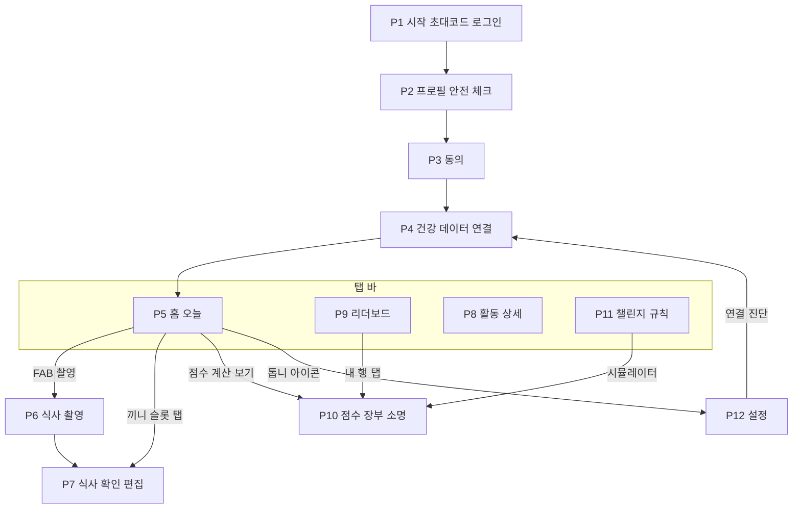
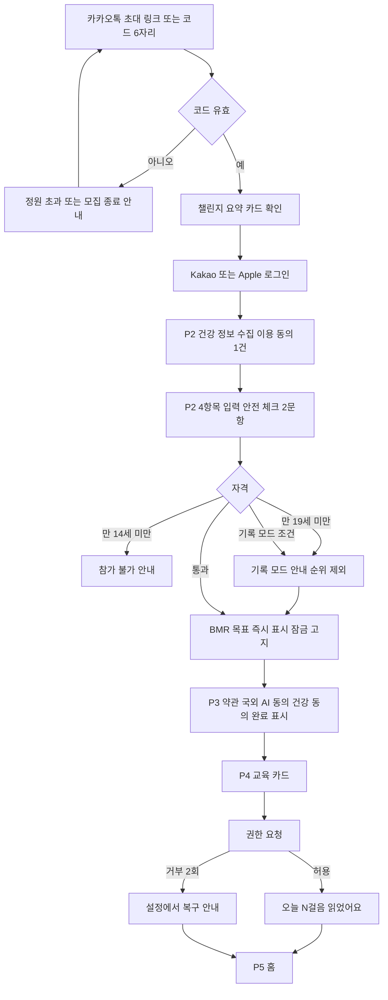
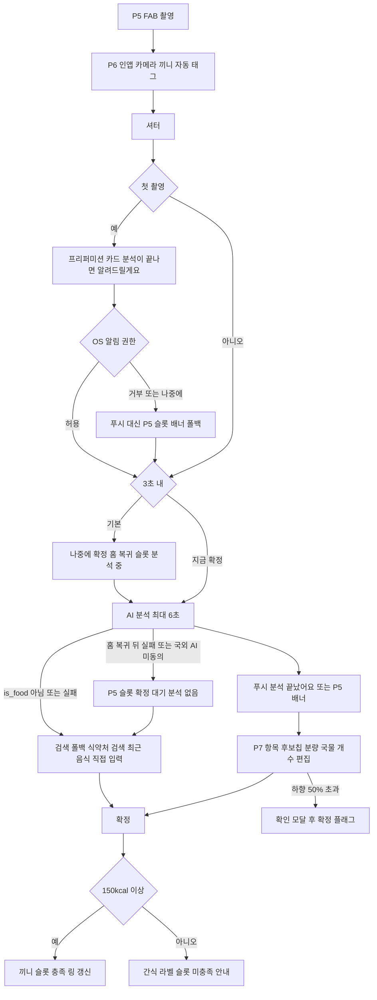
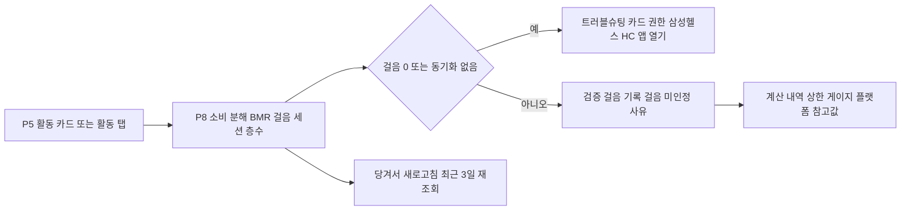
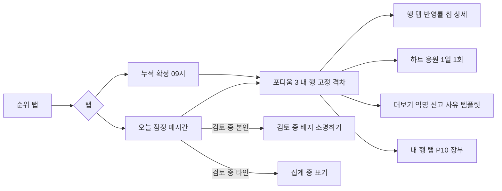
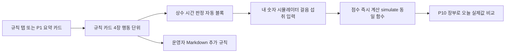
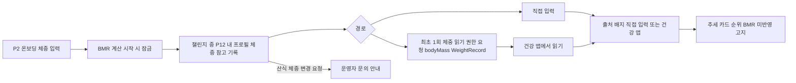

# 06. 화면 설계 (UX/UI 스펙) — 챌로리 (Challory)

작성일: 2026-10-01 | 근거: `02-설계-결정-기록.md`(화면 id·산식 그대로), `01-유사앱-조사.md` 4·7·8장, `03-기능정의서.md` 5·8장 | 용도: HTML 프로토타입 직접 제작용

표기: 결정 기록에 없는 세부는 **[제안]**. 모든 kcal·점수는 "추정"으로 표기한다(App Store 1.4.1).

---

## 1. 디자인 원칙 5개

| # | 원칙 | 화면 적용 | 조사 근거 |
|---|---|---|---|
| 1 | **링 하나, 숫자 셋** — 홈은 순적자 단일 링 + 소비·섭취·점수 3숫자로 끝낸다. Apple 3중 링 재현 금지, 게이지에 현재값·0·목표 텍스트 병기 | P5 | 8장-1, MFP·Yazio·Lifesum 홈 문법, HIG Gauges |
| 2 | **AI는 초안, 확정은 사람** — 모든 추정값은 편집 가능 상태로 먼저 보이고, 순위·링은 확정값만 쓴다. 이름이 바뀌면 kcal도 바뀐다 | P6·P7 | 4.2 NIH 33% 과소, Cal AI "이름만 바뀜" 불만(7장-2) |
| 3 | **숫자에는 항상 출처와 상태** — 잠정/확정/정정/검토 중, 반영률, 대체값·클램프 적용 여부를 숨기지 않는다 | P5·P8·P9·P10 | 7장-5 동기화 조건 숨기기, 7장-6 판정 모호, 8장-8·23 |
| 4 | **3초 입력, 나중에 확정** — 촬영 후 3초 내 홈 복귀가 기본, 편집은 푸시 뒤 한 번에. 온보딩은 필수 4항목 | P2·P6 | 7장-7 긴 온보딩·긴 폼, 페르소나 "10초 넘으면 안 찍음" |
| 5 | **수치심 없는 공정성** — '실패'·공개 지목·깨진 스트릭 강조 금지. 제외·검토는 당사자에게만, 타인에게는 '집계 중' | 전 화면 | 4.5 섭식장애 상관 r=0.36, 7장-10, MoveSpring 공개 지목 금지 |

## 2. 정보구조(IA)와 탭 바

**탭 바 [제안]**: 4탭 + 중앙 FAB, 순서 `홈 · 순위 · [촬영 FAB] · 활동 · 규칙`. 설정(P12)은 홈 톱니, 장부(P10)는 숫자 옆 '점수 계산 보기' 경로(독립 탭 아님). 라벨 상시 표시, 활성 탭은 색+채운 아이콘+굵은 라벨. FAB 56dp, 탭 바 위 8dp 돌출, 라벨 "촬영".

**운영자 웹 콘솔**: OP1~OP4(02 §4)는 참가자 앱과 별도의 반응형 웹(기준 프레임 1280px)이다. IA·컴포넌트는 05 §9([제안] OP0 로그인·챌린지 목록 포함), 상태·카피·접근성은 §4 끝 "OP 화면(웹)" 절에서 P 화면과 같은 7행 표로 정의한다.

## 3. 핵심 사용자 흐름 6개

흐름 1 온보딩→참가. 결정 3-1~4. 재가입 차단자는 사유 없이 "참가할 수 없는 코드예요". [제안] 건강 민감정보 동의(개인정보보호법 23조, 03 F-ACC-03)는 임신·수유·섭식장애 문항을 보기 **전에** 받아야 하므로 P2 최상단에 1건만 먼저 두고, P3는 약관(필수)·국외 AI(선택) 2건 + "건강 정보 동의 완료 ✓" 읽기 전용 카드로 3분리를 유지한다(02 §4 P2·P3). 온보딩은 Recruiting 중에 이뤄지므로 종착 P5는 "시작 전" 상태(§4 P5)로 열린다.

흐름 2 식사 사진 기록. 09:00 미확정 시 max(대체값, 1.3×AI) 자동 확정(P7 하단 고지). 알림 권한은 첫 촬영 직후 기능 시점에 1회 요청 [제안](iOS `UNUserNotificationCenter.requestAuthorization`, Android 13+ `POST_NOTIFICATIONS`; 결정 3-4 기능 시점 원칙). 거부·미요청 상태에서는 N-04·N-02가 전달되지 않으므로 P5 끼니 슬롯 "분석 완료 · 확인하기" 인앱 배너 + 홈 진입 시 끼니 상태 재조회로 대체한다(05 devices.push_permission, 03 §8 N-02·N-04 발송 생략 조건).

흐름 3 활동 확인.

흐름 4 순위 확인.

흐름 5 규칙 확인.

흐름 6 체중 입력. 산식 체중은 시작 시 잠금(결정 7-5). 체중 읽기 권한은 P4가 아닌 "건강 앱에서 읽기" 최초 탭 시점에 요청 [제안](결정 3-4 기능 시점, P4 교육 카드=실제 권한 범위 유지). 챌린지 중 체중 기록은 **참고용·순위 미반영 [제안]**(조사 6장 체중 리더보드 제외, 8장-24 수동/건강 앱 경로, 촬영 인증은 v2).

## 4. 화면별 상세 스펙

공통: 앱바 56, 좌우 여백 16, 카드 간격 12, 숫자는 tabular. 로딩은 스켈레톤, 오류는 인라인 카드 + "다시 시도".

### P1 시작·초대코드·로그인
| 항목 | 내용 |
|---|---|
| 목적·진입 | 코드로 챌린지를 확인하고 로그인. 앱 첫 실행, 초대 링크(설치자 Universal Links/App Links 코드 자동 입력, 미설치자 웹 랜딩 → 스토어 → 첫 실행 클립보드 감지) |
| 레이아웃 | 로고+한 줄 소개 → 클립보드 코드 감지 배너(첫 실행, 6자리 패턴·iOS 16+ 붙여넣기 권한) [제안] → 코드 6칸 입력 → 챌린지 요약 카드 → 로그인 버튼 2개 → 하단 법적 링크 |
| 요소·카피 | 제목 "초대코드를 입력해 주세요" / 소개 "찍고, 걷고, 순위를 확인해요" / 배너 "복사한 초대코드 K7Q2MD를 붙여넣을까요?" [붙여넣기] [아니요] / 카드: 챌린지명·기간·참가 현황·"규칙 미리 보기" / 버튼 "카카오로 계속하기", "Apple로 계속하기"(iOS 필수) / 오류 "코드를 다시 확인해 주세요", "모집이 마감된 챌린지예요", "참가할 수 없는 코드예요"(차단자, 사유 미노출) |
| 데이터 예시 | 코드 `K7Q2MD`, "가을 걷기 챌린지 · 10.6~11.2 28일 · 42/60명" |
| 상태 | 입력 전(카드 숨김)·검증 중(스켈레톤)·유효·오류·딥링크 자동 입력·클립보드 감지 제안 |
| 인터랙션 | 6자리 완료 시 자동 검증, 대문자 변환, 붙여넣기 |
| 접근성 | 코드 칸 각 44pt, 그룹 라벨 "초대코드 6자리", 오류 aria-live |

### P2 프로필·안전 체크
| 항목 | 내용 |
|---|---|
| 목적·진입 | 4항목으로 BMR·목표 산출, 자격 게이트. P1 로그인 직후 |
| 레이아웃 | 진행 표시(1/3) → 건강 정보 수집·이용 동의(필수 1건, 펼치기) [제안] → 성별 세그먼트 → 생년(연도 피커) → 키·체중 숫자 입력 → 즉시 계산 카드 → 안전 체크 2문항 → 잠금 고지 → "다음" |
| 요소·카피 | 동의 "건강 정보 수집·이용에 동의해요 (필수) — 성별·생년·키·체중·안전 체크, 걸음·운동·식사 기록"(체크 전에는 아래 입력 비활성; 민감정보 문항을 보기 전에 받는 별도 동의, 03 F-ACC-03) / 제목 "기본 정보 4가지만 알려주세요" / 생년 "태어난 연도" — [제안] 연도만 수집하므로 만 14세·19세 판정은 해당 연도 12월 31일생으로 보수 적용(14세 미달 가능 시 차단, 19세 미달 가능 시 기록 모드), BMR 나이는 시작일 기준(04 §2) / 계산 카드 "기초대사량 약 1,650 kcal · 하루 목표 적자 500 kcal = 100점"(10 kcal 단위 반올림, 04 §2) / 안전 체크 "현재 임신 또는 수유 중이에요", "섭식장애 진단·치료 경험이 있어요"(체크 시 기록 모드) / 잠금 "시작 후에는 체중·키를 바꿀 수 없어요. 변경은 운영자에게 요청" / 오류 "만 14세 이상만 참가할 수 있어요" / 안내 "만 19세 이상만 순위에 참여해요. 만 14~18세는 기록 모드로 참가해요(점수는 보여요)" / 재확인 "입력값을 한 번 더 확인해 주세요"(BMI<15·>45) / 기록 모드 "기록 모드로 참가해요. 점수는 보이고 순위에는 들어가지 않아요. 이유는 아무에게도 보이지 않아요" |
| 데이터 예시 | 남 · 1996(시작일 기준 만 30세) · 175 cm · 70 kg → BMR_raw 1,648.75 → round10 **1,650**, F 1,320, M 743 — 04 §6 예1·T01과 동일 인물(02 §2·03 §2 동일) |
| 상태 | 동의 전(입력 비활성)·입력 중(카드 "—")·계산됨·차단·기록 모드·재확인 |
| 인터랙션 | 키·체중 변경 시 200 ms 디바운스 재계산, 숫자 키패드 |
| 접근성 | 세그먼트 라디오 역할, 계산 카드 aria-live=polite |

### P3 동의
| 항목 | 내용 |
|---|---|
| 목적·진입 | 3분리 동의. P2 다음(2/3) |
| 레이아웃 | 제목 → 동의 카드 3장(건강 정보 — P2에서 완료 ✓ 읽기 전용 / 이용약관 필수 / 국외 AI 선택, 각 펼치기) → 고지 블록 → "동의하고 계속" |
| 요소·카피 | "건강 정보 수집·이용 (필수) — P2에서 동의함 ✓"(읽기 전용, 철회는 P12), "이용약관 (필수)" / "음식 사진 AI 분석 (선택) — 사진이 국외 AI 서버로 전송돼요. 동의하지 않아도 검색으로 기록할 수 있고 불이익은 없어요"(28조의8 고지 항목 — 이전 국가·수신자·목적·보유기간 — 은 Vertex AI 약관 확인 후 추가, "학습 미사용"은 확인 전 미기재; 05 §8·02 §10-6) / 고지 "사진은 챌린지 종료 7일 후 삭제돼요 · 모든 칼로리는 추정치이며 의료 조언이 아니에요" / 비활성 사유 "필수 항목에 동의해 주세요" |
| 상태 | 미동의(버튼 비활성)·필수 완료·선택 미동의(P6 분석 생략 배지) |
| 접근성 | 체크박스 48dp, "선택" 텍스트 명시 |

### P4 건강 데이터 연결
| 항목 | 내용 |
|---|---|
| 목적·진입 | 교육 후 읽기 권한, 연결 검증. P3 다음(3/3), P12 연결 진단 |
| 레이아웃 | 교육 카드(읽는 항목 5개 아이콘: 걸음·거리·층수·운동 세션·활동 칼로리(참고)) → 플랫폼 버튼 → 검증 카드 → 출처 목록 → Galaxy 가이드 접기 |
| 요소·카피 | 제목 "걸음과 운동을 자동으로 읽어올게요" / 부제 "걸음·거리·층수·운동 세션을 읽어요. 활동 칼로리는 참고 표시용으로만 읽고, 어떤 데이터도 쓰지 않아요"(교육 카드 항목 = 실제 OS 권한 시트 항목; 체중 bodyMass/WeightRecord는 P12 "건강 앱에서 읽기" 최초 탭 시 별도 요청 — 흐름 6 [제안]; 03 F-ACT-01 입력·05 §5 권한 행과 1:1) / 버튼 "Apple 건강 연결" · "Health Connect 연결"(영문 "Connect to…" 문구 금지) / 검증 "오늘 6,210걸음을 읽었어요 ✓" / 출처 "삼성헬스 · Health Connect" / 걸음 0 "아직 읽은 걸음이 없어요. 삼성헬스 → Health Connect 동기화를 켜 주세요" / 거부 2회 "설정 앱에서 권한을 켜면 바로 이어져요" / Android 13 이하 "Health Connect 앱 설치가 필요해요" / "나중에 연결(활동 0으로 집계)" |
| 상태 | 교육·요청 중·연결 성공·걸음 0·거부·미지원 |
| 접근성 | 플랫폼 아이콘에 대체 텍스트, 검증 결과 aria-live |

### P5 홈(오늘)
| 항목 | 내용 |
|---|---|
| 목적·진입 | 오늘 순적자·점수·순위 한눈에, 모든 기록의 허브. 기본 탭, 푸시 N-01·N-02 랜딩 |
| 레이아웃 | 앱바(챌린지명·D+8/28·톱니) → 공지 배너(최근 1건·제목 1줄·읽지 않음 점·닫기, 탭 시 전문 시트 — N-03 랜딩) [제안] → 날짜 스트립(좌우 스와이프, 오늘 강조) → 칼로리 링 카드 → 점수·순위 카드 → 반영률 4칸 칩 → 끼니 슬롯 4개(아침·점심·저녁·간식) → 건강 안내 카드(조건부) → 활동 카드 → 하단 면책 1줄 |
| 요소·카피 | 링 중앙 **"−144 kcal"** 부제 "목표 −500의 29%" / 3숫자 "소비 약 1,944 · 섭취 1,800 · 점수 28.8" / 상태 칩 "잠정 · 21:10 동기화" / 점수 카드 "오늘 28.8점 · 누적 312.6점 · 잠정 4위 ▲2" + **"점수 계산 보기"** / 반영률 "아침 ✓ 점심 ✓ 저녁 ✓ 걸음 ✓ · 100%" / 빈 슬롯 "아직 기록 없음 · 미기록 시 743 kcal로 계산돼요" / "분석 중… 끝나면 알려드려요" / "AI 초안 약 850 kcal · 확인 필요 · 1,105 kcal로 잠정 계산 중" / 초안 잠정 "점심 미확정 → 1,105 kcal로 잠정 계산 중 · 확정하면 반영" / 확정 대기 "사진은 저장됐어요 · 음식을 찾지 못해 검색으로 확정이 필요해요"(실패) · "AI 분석 없이 저장됐어요 · 검색으로 확정해 주세요"(국외 AI 미동의) / 알림 거부 폴백 배너(슬롯 상단) "분석 완료 · 확인하기" / 공지 배너 "[공지] 최종 결과는 11.3 09:00에 확정돼요" / 건강 안내 카드 "오늘 섭취 기록이 적어요. 점수와 무관하게 충분히 드세요 · 추정치예요"(중립 톤, 하한 클램프 칩과 다른 아이콘·색, N-07 랜딩) / 시작 전 "10월 6일에 시작해요 · 연결 상태 확인" / 최종 집계 중 "최종 집계 중 · 운영자 확인 후 발표돼요" / 결과 확정 "최종 결과 · 이의 기간 ~11.10" / 오프라인 칩 "오프라인 · 21:10 기준" / 활동 카드 "걸음 9,000 · 활동 약 294 kcal · 삼성헬스" / 동기화 0건 "오늘 걸음을 못 읽었어요 · 연결 확인" / 면책 "모든 수치는 추정이에요" |
| 데이터 예시 | BMR 1,650 / A 294 / I 1,800 / D 144 / S 28.8 / 누적 312.6 / 4위 ▲2 / 반영률 4/4 |
| 상태 | 로딩·잠정·확정(칩 "확정")·정정(칩 "정정")·검토 중(본인 "검토 중 · 소명하기")·기록 모드(순위 자리 "기록 모드")·대체값("저녁 미기록 → 743 kcal 적용 중")·초안 잠정 대체값(status=draft 끼니를 max(M_p, 1.3×AI)로 산입, 링 하단 캡션, 04 §4.3 잠정 계산·T23)·하한("섭취 하한 1,320 적용")·0끼("끼니를 1개 이상 확정하면 점수가 생겨요")·점검 기간(D1~3 "누적 미반영")·확정 대기(슬롯 warn ✎, 실패·미동의 공용)·알림 거부(인앱 배너 + 홈 진입 시 끼니 상태 재조회)·오프라인(링은 마지막 값, 당겨서 새로고침 시 "연결 후 갱신돼요")·건강 안내(확정 섭취(대체값 제외) < 남 1,500/여 1,200, 04 §8·03 F-FAIR-01 ①, 하한 클램프 칩과 별개)·공지 있음 / 생명주기(03 §7): 시작 전(Recruiting, D−3, 링 비움, CTA→P4)·최종 집계 중(Closing, 링 잠금, 칩 review)·결과 확정(Published, 최종 순위 카드+이의 기간)·종료(Archived, 열람 전용) |
| 인터랙션 | 링→P10, 슬롯→P7(빈 슬롯은 P6), 활동 카드→P8, 공지 배너→전문 시트(읽음 처리 read_at), 당겨서 새로고침(3일 재조회), 날짜 스와이프 시 링 애니메이션 300 ms |
| 접근성 | 링 role=img "오늘 순적자 144 kcal, 목표의 29%", 숫자·텍스트 병기, 모션 감소 시 애니메이션 생략 |

### P6 식사 촬영
| 항목 | 내용 |
|---|---|
| 목적·진입 | 3초 촬영 후 복귀. FAB, 빈 슬롯 탭 |
| 레이아웃 | 전면 뷰파인더 → 상단 끼니 태그 칩(자동, 변경 가능) → 접시 가이드 프레임 → 하단 셔터·"나중에 확정"(기본 선택)·"지금 확정" 토글 → 보조 "사진 없이 기록" |
| 요소·카피 | 태그 "점심"(04~10:30 아침 / ~15 점심 / ~22 저녁 / 그 외 간식 [제안]) / 가이드 "접시 전체가 보이게, 위에서 찍어 주세요" / 토스트 "저장했어요. 분석이 끝나면 알려드려요"(1.5초 후 홈) / 미동의 "AI 분석 없이 저장돼요. 검색으로 확정해 주세요" / 실패 "카메라를 열 수 없어요 · 검색으로 기록" / 오프라인 "연결되면 자동 업로드돼요" / 알림 프리퍼미션(첫 촬영 직후 1회) "분석이 끝나면 알려드릴게요" [알림 켜기] [나중에] → OS 권한 요청; 거부 "홈 화면에서 결과를 알려드릴게요" |
| 상태 | 권한 요청(카메라)·촬영 가능·처리 중(0.5초 플래시)·알림 프리퍼미션(첫 촬영 직후: 허용/거부/나중에)·실패·오프라인 큐·지연 업로드(오프라인 큐 업로드 후 서버가 단말 시각으로 태그, 토스트 "어제 저녁으로 기록됐어요 · 지연 업로드") |
| 인터랙션 | 셔터 72dp, 볼륨 키 촬영 [제안: iOS 17.2+ `AVCaptureEventInteraction`·Android만, 네이티브 구현(`camera` 플러그인 미제공); 미지원 버전은 안내 미노출, App Store 2.5.9 준수를 위해 비공개 방식 금지 — 05 §2 네이티브 모듈], 갤러리 버튼 없음 |
| 접근성 | 셔터 라벨 "촬영", 가이드 텍스트 병기, 플래시 모션 감소 대응 |

### P7 식사 확인·편집
| 항목 | 내용 |
|---|---|
| 목적·진입 | AI 초안 편집·확정. 푸시 N-04, 슬롯 탭 |
| 레이아웃 | 사진 썸네일+끼니 태그 → 합계 바(AI 초안 vs 현재) → 항목 카드 리스트 → "항목 추가"(검색·최근·직접 입력) → '먹은 것만 체크' 안내 → 하단 고정 "확정" + "건너뜀" |
| 요소·카피 | 합계 "현재 약 850 kcal (AI 초안 850)"(항목 체크 해제·편집 시 현재값만 갱신, 예: 김 해제 → "현재 약 780 kcal (AI 초안 850)") / 항목 카드: 이름 + 후보 칩 "김치찌개 · 부대찌개 · 된장찌개" + 가정 분량 "1인분 · 약 400 g" + "반 공기 / 1공기 / 곱빼기" 또는 슬라이더 0.5~2.0 + 국물 토글 "국물 안 먹음(−40%)" + 개수 스테퍼 + 반찬 "1젓가락" + 신뢰도 배지 / 간식 "150 kcal 미만은 간식이에요. 섭취에는 더해지지만 끼니 슬롯은 채우지 않아요"(04 §4.3 I_d 간식 합산) / 하향 모달 "AI 추정보다 50% 넘게 낮아요. 그대로 확정할까요? 운영자가 확인할 수 있어요" / 하단 고지 "09:00까지 확정하지 않으면 max(743, 1.3×AI) kcal로 자동 확정돼요. 그 뒤 48시간 안에는 고칠 수 있어요"(04 §4.3·P11 시간 블록) / 건너뜀 버튼 "건너뜀 (남은 2회)"(05 API #13 남은 횟수 병기) + 설명 "이 끼니는 먹지 않았어요(오늘 1회·주 3회)" / 한도 도달 "이번 주 건너뜀 3회를 모두 썼어요. 안 먹은 끼니는 743 kcal로 계산돼요"(버튼 비활성, 03 F-MEAL-03 예외) / 폴백(검색 전용) "음식을 찾지 못했어요. 이름으로 검색해 주세요" · 미동의 "AI 분석 없이 저장된 사진이에요. 검색으로 확정해 주세요" / 오프라인 "연결되면 확정할 수 있어요"(확정 비활성) / 지연 업로드 배지 "지연 업로드 · 10.12 저녁으로 기록됨"(날짜·슬롯은 서버 판정값, 사용자 변경은 슬롯만) / 미인정 "확정이 끝난 날이라 점수에 들어가지 않아요 · 사진은 보관돼요"(is_final 날짜) |
| 데이터 예시 | AI 초안 6항목: 흰쌀밥 1공기 210 g 310 · 김치찌개 1인분 260 · 계란말이 2조각 180 · 멸치볶음 1젓가락 20 · 배추김치 1젓가락 10 · 김 1봉 70 → **850 kcal**, 확실 5·확인 필요 1 / 사용자가 '먹은 것만 체크'로 김 해제 → **780 kcal** 확정(04 T23 "850→780", §7 점심 780 확정; 미확정 시 자동 확정 max(743, 1.3×850)=1,105) |
| 상태 | 분석 중(스켈레톤)·초안·검색 전용(초안 없음 — 실패·국외 AI 미동의 공용, "항목 추가"가 1차 CTA)·확정·자동 확정("자동 확정 1,105"+"수정하기")·정정 가능(48h)·잠금·간식·건너뜀 한도 도달(버튼 비활성+사유)·오프라인(항목 열람 가능, 확정 비활성)·검토 중·지연 업로드·미인정(is_final) |
| 인터랙션 | 후보 칩 탭→이름·kcal 즉시 재계산(합계 카운트업 200 ms), 스와이프 삭제, 체크 해제=먹지 않음 |
| 접근성 | 칩은 라디오 그룹, 슬라이더 값 텍스트 병기, 합계 변경 aria-live |

### P8 활동 상세
| 항목 | 내용 |
|---|---|
| 목적·진입 | 소비 분해·검증 상태·문제 해결. 활동 탭, P5 활동 카드 |
| 레이아웃 | 날짜·동기화 상태 칩 → 소비 분해 카드(BMR+걸음+세션+층수=합계) → 상한 게이지 → 걸음 카드(플랫폼별 분기, 아래) → 세션 리스트 → 층수 카드(데이터 있을 때만) → 플랫폼 참고값 → 계산 내역 접기 → 트러블슈팅 |
| 요소·카피 | 분해 "기초대사 1,650 + 걸음 294 + 세션 0 = 소비 약 1,944 kcal" / 게이지 "활동 294 / 상한 1,000" / 걸음 카드 — Android(Health Connect) "걸음 9,000 · 삼성헬스": aggregate는 timeRange·dataOrigin 필터만 받아 recordingMethod로 수동 걸음을 분리할 수 없고(01 §5.2 readRecords 합산 금지) 04 §3.1도 "사후 판별해 플래그"이므로 수동 출처 감지 시 숫자 대신 "수동 입력 출처가 섞여 있어 검토 중이에요 · 잠정 유지" / iOS "검증 9,000 · 기록 9,340 · 미인정 340 (수동 입력)" [제안: `HKStatisticsCollectionQuery`에 WasUserEntered≠true predicate로 집계 2회 후 차감 — 05 §5 steps_manual·04 §3.1] / 세션 창 걸음 "4,500보는 세션으로 계산됐어요" / 세션 빈 "자동 기록된 운동이 없어요. 워치·운동 앱 세션만 인정돼요" / 참고값 "삼성헬스 활동 칼로리 — 제공 안 됨" 또는 "Apple 건강 활동 380 kcal (참고값, 순위 미반영)" / 계산 내역 "걸음 × (3.8−1) × 70 ÷ 6,000 = 0.0327 kcal/보"(58 kg 참가자는 0.0271) / 트러블슈팅 "걸음이 0이에요 → ① 삼성헬스 동기화 켜기 ② Health Connect 권한 ③ 앱 다시 열기" / 칩 "21:10 동기화 · 삼성헬스" |
| 데이터 예시 | 예시 1(지수, Galaxy·삼성헬스): 걸음 9,000 → 294, 세션 0, 층수 숨김, 합 294 / 예시 2(워치, 58 kg 여, 다른 참가자 예: 밤산책 — 02 §5·04 §6 예2): 기록 12,000 − 세션 창 4,500 = 세션 외 걸음 7,500 → 203.0, 달리기 30분 9 km/h MET 8.5 → 217.5, 합 420.5, 계산 내역 "(3.8−1)×58÷6,000 = 0.0271 kcal/보", 참고값 "Apple 건강 활동 380 kcal" / iPhone 변형(지수와 동일 수치, 검증 9,000·기록 9,340·미인정 340) |
| 상태 | 로딩·정상·동기화 없음·걸음 0·검토 중(걸음 26,000 "검토 중 · 잠정 유지")·수동 출처 감지(Android, 숫자 미표시·검토 중)·상한 도달 |
| 인터랙션 | 당겨서 새로고침, 세션 탭→MET·시간·출처 시트 |
| 접근성 | 게이지 role=progressbar 값 텍스트, 미인정 사유 명시 |

### P9 리더보드
| 항목 | 내용 |
|---|---|
| 목적·진입 | 오늘·누적 순위, 격차, 공정성 참여. 순위 탭 |
| 레이아웃 | 세그먼트 "오늘(잠정) / 누적" → 상태 줄 → 포디움 3 → 내 행(상단 고정 스티키) → 전체 리스트(20명 페이지) → 하단 주간 피드백 카드 |
| 요소·카피 | 상태 줄 "잠정 · 매시간 갱신 · 내일 09:00 확정" / "확정 · 10.13 09:00" / 행: 순위·닉네임·점수·반영률 칩·(선택)등급 배지·하트 / 내 행 "4위 지수(나) 312.6 · 3위까지 76.1점" / "5위(공동)"(04 §5.5 1-2-2-4, 다음 순위 7) / 타인 검토 "집계 중" / 본인 "검토 중 · 소명하기" / 하트 "응원했어요(오늘 1회)" / 더보기 "익명으로 신고" → 시트 "날짜·끼니 → 사유: 사진 재사용 / 음식 아님 / 걸음 비정상 / 기타" → "신고했어요. 운영자가 확인해요" / 빈 "아직 확정된 점수가 없어요(점검 기간)" / 시작 전 "10월 6일에 시작해요 · 규칙 미리 보기" / 최종 집계 중 "최종 집계 중 · 운영자 확인 후 발표돼요"(세그먼트 잠금) / 최종 확정 "최종 결과 · 이의 기간 ~11.10"(포디움 고정, 내 행→P10 이의) / 종료 "종료된 챌린지 · 열람만 가능해요" / 주간 피드백 "이번 주 평균 39.1점 · 저녁 확정률 86%" / opt-out "순위 비공개 중 · 내 행만 보여요" |
| 데이터 예시 | 1 달려라하니 486.2 · 2 강남콩 451.0 · 3 밤산책 388.7 · **4 지수(나) 312.6 ▲2** · 5(공동) 오이냉국 301.9 · 5(공동) 새벽러닝 301.9 · 7 집계 중 … 42명 |
| 상태 | 로딩·잠정·확정·빈·검토 중(본인/타인)·opt-out·기록 모드("기록 모드 · 순위 없음") / 생명주기(03 §7): 시작 전·최종 집계 중(Closing)·최종 확정(Published, 포디움 고정)·종료(Archived, 열람 전용) |
| 인터랙션 | 내 행→P10, 하트 1일 1회(재탭 "내일 다시 응원할 수 있어요"), 무한 스크롤 |
| 접근성 | 행 44pt, 변동은 "2계단 상승" 텍스트, 하트 상태 라벨 |

### P10 점수 장부·소명
| 항목 | 내용 |
|---|---|
| 목적·진입 | "왜 이 점수인가"를 숫자로. P5 링/점수 카드, P9 내 행, P11 시뮬레이터, 푸시 N-05·N-06 |
| 레이아웃 | 오늘 산식 카드(값 대입) → 일별 표(날짜·BMR·A·I·D·S·표시) → 적용 규칙 칩 → 변경 이력 → 검토·소명 섹션(당사자만) |
| 요소·카피 | 산식 "(1,650 + 294) − max(1,800, 1,320) = 144 → 144 ÷ 500 × 100 = **28.8점**" / 칩 "대체값 743 적용(아침)", "섭취 하한 1,320 적용", "활동 상한 1,000 적용", "자동 확정 1,105(점심)", "미확정 초안 1,105 잠정 반영(점심)"(breakdown.draft_kcal, 잠정 행만) / 병기 "체중 비례 목표(T∝W) 시 —점"(02 §5·04 §5.6이 "장부 병기만"이라고만 하고 산식·기준 체중을 정의하지 않아 정의 전까지 숫자 미표시 [미결]) / 이력 "10.10 점심 850→780 확정(본인) · 10.09 걸음 재조회 +120" / 정정 "10.12(D7) 저녁 무효 → 대체값 743 · 41.2→12.7 · 같은 사진이 두 번 이상 사용됐어요"(§6 템플릿 dup_photo) / 검토 "걸음 26,000이 평소의 2.5배를 넘어 검토 중이에요. 72시간 안에 설명을 남길 수 있어요(1회)" / 소명 "무슨 일이 있었나요?" 500자 · "설명 보내기" → "운영자가 72시간 안에 확인해요" / 판정(§6 사유 템플릿 조합, 03 F-FAIR-01 4단계) 승인 "확인이 끝났어요 · 점수 변동 없음" · 경고 "경고 1/3 · 점수 변동 없음" · 무효 "대체값 743으로 다시 계산했어요 · 10.12 41.2→12.7" · 순위 제외 "경고가 3회 누적되어 이번 챌린지 순위에서 빠졌어요. 점수와 기록은 계속 볼 수 있어요" / 소명 기간 만료 "설명 기간이 지났어요. 기록으로만 확인했어요"(03 F-LEDGER-01 예외) / 경고 칩 "경고 1/3"(상단, 본인만) / 결과 이의 [제안] Published 7일 동안 하단 "결과에 이의 남기기"(1회) — 05 reviews.type=objection·API #34 / 빈 "첫 확정은 내일 09:00에 생겨요" |
| 데이터 예시 | D3(10.8) 점검 기간·아침 미기록 M 743 S 0.0(누적 미반영) / D6(10.11) I 1,150→F 1,320 적용 S 124.8(남 임계 1,500 미달 → P5 건강 안내) / D7(10.12) 정정 41.2→12.7(사진 중복 무효) / D8(10.13) 오늘 28.8 잠정 |
| 상태 | 로딩·잠정·확정·정정·검토 중·소명 제출됨·소명 기간 만료·판정 완료(승인/경고 N/3/무효/순위 제외)·결과 확정(이의 CTA)·점검 기간 |
| 인터랙션 | 표 행→해당 날짜 P5, 칩→규칙 설명 시트(P11 블록 재사용) |
| 접근성 | 표 header 스코프, 산식은 읽기 순서 텍스트, 수식 기호 대체 텍스트 |

### P11 챌린지 규칙
| 항목 | 내용 |
|---|---|
| 목적·진입 | 규칙=적용 규칙. 규칙 탭, P1 "규칙 미리 보기", P10 칩 |
| 레이아웃 | 규칙 카드 4장(가로 스와이프) → 상수 블록(자동) → 시간 블록 → 판정 블록 → 내 숫자 시뮬레이터 → 운영자 Markdown → 한계 고지 |
| 요소·카피 | "① 먹은 걸 찍어요 — 세 끼를 찍고 확정하면 끝. 안 찍은 끼니는 743 kcal로, 간식은 찍은 만큼 더해져요" / "② 움직여요 — 걸음·달리기·계단 자동 기록만 인정. 하루 활동 최대 1,000 kcal" / "③ 점수는 이렇게 — (기초대사 + 활동) − 섭취 = 순적자, 500 kcal면 100점, 최대 150점" / "④ 공정하게 — 폰이든 워치든 같은 공식. 이상 기록은 조용히 확인하고 설명 기회를 드려요" / 상수 "T 500 · 활동 상한 1,000 · 섭취 하한 max(1,200, 0.8×BMR) · 대체값 max(700, 0.45×BMR) · 간식 150 · 걸음 30,000 · 층수 50" / 시간 "매시간 잠정 · D+1 09:00 확정 · 점검 첫 3일 · 수정 48시간" / 판정 "검토 중 → 소명 1회(72h) → 승인 · 경고 · 무효 · 순위 제외(경고 3회)" / 시뮬레이터 "걸음 [9,000] 달리기 [0분] 섭취 [1,800] → 예상 28.8점" / 한계 "일부만 찍는 기록은 완전히 막을 수 없어요. 신고와 운영자 확인으로 보완해요" |
| 상태 | 로딩·정상·운영자 Markdown 없음(숨김) |
| 인터랙션 | 입력 즉시 재계산(/simulate), 결과 탭→P10 비교 |
| 접근성 | 카드 스와이프에 점 인디케이터+이전/다음 버튼, 수식은 문장 병기 |

### P12 설정
| 항목 | 내용 |
|---|---|
| 목적·진입 | 계정·연결·공개 범위·동의. 홈 톱니 |
| 레이아웃 | 프로필 섹션(닉네임·잠긴 항목) → 체중 기록(참고) [제안] → 연결 진단 → 알림 → 공지 목록 [제안] → 공개 설정 → 동의·데이터 → 계정 |
| 요소·카피 | 잠금 "체중 70 kg · 키 175 cm 🔒 시작 시 잠금 · 변경은 운영자 문의" / 체중 기록 "오늘 체중(참고용) [69.4] kg · 건강 앱에서 읽기" 배지 "직접 입력 / 건강 앱" + "점수·BMR에는 반영되지 않아요" / 연결 진단 "삼성헬스 · 21:10 동기화 · 오늘 9,000걸음 ✓" / 알림 "어제 결과 09:30", "저녁 리마인드 21:00", "분석 완료"(공지·검토·판정·건강 안내는 끌 수 없음, 03 §8) / OS 알림 꺼짐 칩 "알림이 꺼져 있어요 · 설정에서 켜기"(OS 설정 딥링크, 거부자는 P5 배너로 대체 중 안내) / 공지 목록 "공지"(제목·날짜·읽음 표시, 탭 시 전문 시트 — N-03 보관함) / 공개 "순위에 내 행 보이기", "측정 등급 배지 보이기(기본 꺼짐)" / "AI 사진 분석 동의 철회" / "계정 삭제 — 사진·식사·걸음·체중 기록은 즉시 삭제되고, 일별 점수만 익명으로 챌린지 종료까지 남아요" 2단계 모달(05 §8) |
| 상태 | 정상·연결 끊김(점+"연결 확인")·OS 알림 꺼짐·동의 철회됨(촬영 시 검색 경로) |
| 접근성 | 토글 상태 텍스트, 삭제 버튼 critical 색+텍스트 |

### OP 화면(웹) — 운영자 콘솔 OP1~OP4

공통 [제안]: 반응형 웹(기준 1280px, 최소 1024px), 좌측 내비(OP0 목록 → OP1~OP4, 미결 건수 배지), 상단 바에 챌린지명·상태(03 §7 8상태)·D-day. 5.1 토큰·§6 카피 원칙을 그대로 쓰고 판정 문구는 §6 사유 템플릿만 사용한다. 1회차를 Supabase Studio+SQL 뷰로 대체해도(02 §8) OP3 판정 폼·OP4 "미결 N건" 차단 배너는 필수다. 운영자 전용 데이터(건강 알림·기록 모드 사유)는 `--review-soft` 배경 + "운영자만 열람" 라벨로 시각 분리(O-06). 표는 header 스코프, 모든 행 작업은 키보드 접근 가능, 상태는 색+아이콘+텍스트.

#### OP1 챌린지 설정·규칙·초대코드
| 항목 | 내용 |
|---|---|
| 목적·진입 | 기간·정원·상수 설정, 규칙 Markdown, 샘플 시뮬레이션, 상태 전환(O-01~03). OP0 카드, 좌측 내비 |
| 레이아웃 | 2열: 좌 설정 폼(기본 정보 → 상수 카드 → 규칙 Markdown 편집기) / 우 P11 동일 미리보기(390px 프레임) → 하단 샘플 3명 시뮬레이션 표 → 초대코드·링크 카드 → 상태 전환 바 |
| 요소·카피 | 기본 "기간 7~30일 · 정원 30~100명" / 상수 카드 "T 500 · 활동 상한 1,000 · 섭취 하한 max(1,200, 0.8×BMR) · 대체값 max(700, 0.45×BMR) · 간식 150 · 걸음 30,000 · 층수 50 · 건너뜀 1/일·3/주 · 점검 3일"(v1 조정 불가 항목은 읽기 전용, 04 §5.2) / 잠금 "시작(점검 기간 진입) 후에는 기간·정원·상수가 바뀌지 않아요 🔒" / 미리보기 "참가자가 보는 규칙 화면과 같아요" / 시뮬레이션 "폰만 70 kg 남 → 28.8 · 워치 58 kg 여 → 72.1 · 1끼 600만 확정 → 0.0"(05 API #25, 골든 3건) / 초대 "코드 K7Q2MD · 초대 링크 복사 · 카카오톡 공유 문구" / 전환 "모집 시작" · "취소(참가자에게 공지)" / 전환 모달 "모집을 시작하면 초대코드가 활성화돼요" |
| 데이터 예시 | 가을 걷기 챌린지 10.6~11.2 · 정원 60 · 상수 기본값 · 샘플 28.8 / 72.1 / 0.0 · Recruiting 42/60명 |
| 상태 | Draft(전체 편집)·Recruiting(편집 가능, 참가자 수 표시)·시작 후(Checking 이후 폼 읽기 전용 🔒, Markdown만 편집 가능 [제안])·전환 확인 모달·Cancelled(읽기 전용) |
| 인터랙션 | Markdown 입력 즉시 미리보기 갱신, 상수 변경 시 시뮬레이션 표 자동 재계산, 전환 버튼은 03 §7 상태도에 허용된 것만 노출 |
| 접근성 | 폼 라벨 명시, 잠금 항목 aria-readonly + 🔒 텍스트, 미리보기 iframe title "참가자 규칙 미리보기" |

#### OP2 참가자·동기화 현황
| 항목 | 내용 |
|---|---|
| 목적·진입 | "걸음 0" 문의 즉답, 조치(제외·강퇴·재가입 차단·메모), 건강 신호 비공개 열람(O-04~06). 좌측 내비, OP0 카드 |
| 레이아웃 | 요약 카드 4개(참가자 42/60 · 오늘 동기화율 93% · 미확정 끼니 17 · 미결 검토 3) → 필터 칩(전체·미동기화·플래그·기록 모드·제외) → 참가자 표(닉네임·상태·마지막 동기화·출처·오늘 걸음·끼니 확정 n/3·경고 n/3·조치) → 개인 드로어(우측: 일별 A/I/S 미니 장부·출처 목록·연결 상태·메모) → 하단 접힘 섹션 "건강 알림(비공개)" |
| 요소·카피 | 표 상태 "동기화 21:10 · 삼성헬스" / 미동기화 "오늘 동기화 없음 · 마지막 10.12 22:40"(warn) / 기록 모드 "기록 모드"(사유 미표시; 드로어에서도 사유는 "운영자만 열람" 배경 안) / 조치 메뉴 "순위 제외 · 강퇴 · 재가입 차단 · 메모" → 모달 "강퇴하면 이 참가자는 순위에서 빠지고 재가입이 차단돼요. 당사자에게 사유는 보이지 않아요" / 건강 섹션 헤더 "건강 알림 · 운영자만 열람 · CSV 미포함" / 건강 행 "밤산책 · 섭취 기록 3일 연속 적음(10.9~10.11) · 넛지 발송됨" / 빈 "아직 참가자가 없어요 · 초대코드를 공유해 주세요" |
| 데이터 예시 | 42명, 미동기화 3명(Galaxy·삼성헬스 동기화 OFF), 플래그 2명, 기록 모드 1명 / 건강 알림 2건(low_intake_3d 1 · high_activity_3d 1) |
| 상태 | 빈(Recruiting 0명)·정상·필터 적용(미동기화 N명)·드로어 열림·조치 확인 모달·조치 완료 토스트("순위에서 제외했어요 · 감사 로그 기록")·건강 섹션 접힘/펼침 |
| 인터랙션 | 행 클릭 → 드로어, 열 정렬, 내보내기는 OP4에서만, 조치는 모달 2단계 + audit_logs |
| 접근성 | 표 header scope·행 44px, 건강 섹션 aria-label "운영자 전용 비공개 섹션", 조치 버튼 critical 색+텍스트 |

#### OP3 검토 큐·판정
| 항목 | 내용 |
|---|---|
| 목적·진입 | 플래그·신고·소명을 한 큐에서 증거와 함께 72h 안에 판정(O-07~09). 좌측 내비(미결 배지), OP2 드로어 "검토 보기" |
| 레이아웃 | 상단 요약(미결 3 · 24h 이내 1 · 초과 0) → 큐 표(유형·대상 닉네임·날짜·SLA 잔여·상태 open/appealed/decided, SLA 잔여 오름차순) → 상세 2열: 좌 증거 패널(걸음 7일 추이+출처·세션 / 사진 썸네일+중복 쌍·해시 / AI 초안 vs 확정 항목 / 소명 텍스트) · 우 판정 폼(판정 4단계 라디오 → 사유 템플릿 선택(§6) → "점수 영향 미리보기" → 당사자 알림 미리보기 → "판정 확정") → 하단 감사 로그 |
| 요소·카피 | 큐 행 "걸음 급증 · 달려라하니 · 10.12 · 남은 41h · 소명 도착" / SLA 임박 "남은 18h"(warn) / 초과 "+6h 초과"(critical) / 판정 라디오 "승인 · 경고 · 무효 · 순위 제외" / 미리보기(dry_run, 완료 건인 지수 10.12 건을 판정 직전 상태로 재현 — `#op3-dry-run`·`#op3-decided` 공용) "S 41.2 → 12.7 · 누적 341.1 → 312.6(−28.5) · 순위 4 → 4 · 저녁 → 대체값 743"(3위 388.7·5위 301.9 사이라 순위 불변) / 알림 미리보기 "당사자에게만 보내요: '같은 사진이 두 번 이상 사용됐어요. 대체값 743으로 다시 계산했어요 · 10.12 41.2→12.7'" / 확정 후 "판정을 저장했어요 · N-06 발송 · 감사 로그 기록" / is_final 이후 태그 "정정으로 기록돼요" / 경고 3회 "이 판정으로 경고 3회 → 순위 제외가 함께 적용돼요" / 빈 "미결 0건 · 최종 확정이 가능해요" / 신고 건 "신고자는 표시되지 않아요" |
| 데이터 예시 | 미결 3: 걸음 급증(달려라하니, 10.12, 소명 도착) · 사진 중복(지수, 10.12 저녁) · 신고(기타) / 완료 12. 지수 10.12 저녁 사진 중복 건은 P10 정정 이력·§7 누적 312.6과 같은 건이며, 프로토타입 OP3는 이 건을 "판정 직전 상태"로 재현해 dry_run(41.2→12.7, 누적 341.1→312.6, 순위 4→4)을 보여준다. 판정 확정 시 `#op3-decided`로 이동하고 미결 배지 3→2 |
| 상태 | 빈 큐·정상·SLA 임박(<24h, warn)·SLA 초과(critical)·소명 도착(appealed)·dry_run 미리보기·판정 확정됨·정정 태그(is_final 이후)·경고 3회 안내 |
| 인터랙션 | 판정·템플릿 선택 즉시 dry_run 호출(05 API #28), "판정 확정"은 미리보기 확인 후 활성, 사진은 서명 URL 10분·열람 로그 |
| 접근성 | 라디오 그룹 라벨 "판정", 미리보기 aria-live, 증거 이미지 대체 텍스트 "식사 사진 10.12 저녁", SLA는 색 없이 텍스트 병기 |

#### OP4 결과·공지·CSV·파기
| 항목 | 내용 |
|---|---|
| 목적·진입 | 최종 순위 확정("미결 0건" 조건), 공지 발송, CSV 4종, 이의 기간·사진 파기(O-10~11). 좌측 내비, OP3 빈 큐 CTA |
| 레이아웃 | 상태 배너(차단 / 확정 가능 / 확정됨 / 파기 완료) → 최종 순위 표(Published 스냅샷: 순위·닉네임·누적·확정 끼니 수) → 공지 작성 카드(제목·본문·발송 대상 전원·미리보기) → CSV 4종 버튼 → 이의 기간 타이머·파기 체크 |
| 요소·카피 | 차단 배너 "미결 3건이 있어 최종 확정을 할 수 없어요 → 검토 큐 열기"(critical, 확정 버튼 비활성) / 확정 가능 "미결 0건 · 최종 확정하면 결과가 발표되고 7일 이의 기간이 시작돼요" / 확정 모달 2단계 "최종 확정 후에는 정정만 가능해요" / 확정됨 "결과 확정 11.3 09:30 · 이의 기간 ~11.10 · 이의 0건" / 공지 "제목(40자) · 본문(500자) · 발송 전원 42명 · 미리보기 → 보내기" → "42명에게 보냈어요"(N-03, P5 배너·P12 공지 목록에 보관) / CSV "최종 순위 · 일별 장부 · 끼니 확정값 · 활동 분해(건강 신호 미포함)" / 파기 "사진 원본 파기(해시·확정값만 보존) — 이의 기간 종료 후 활성" → 확인 "되돌릴 수 없어요" → "1,247장 파기 완료 11.10 10:02" |
| 데이터 예시 | 최종 1 달려라하니 1,310.4 · 2 강남콩 1,254.0 · 3 밤산책 1,102.7 … 42명(순위 제외 2명은 명단 미표시) / 공지 "최종 결과는 11.3 09:00에 확정돼요" / 파기 1,247장 |
| 상태 | Closing-미결 N건 차단·Closing-확정 가능·확정 모달·Published(이의 타이머)·이의 접수 N건(OP3 연결)·Archived(파기 가능)·파기 완료(열람 전용) |
| 인터랙션 | 확정 버튼은 미결 0건일 때만 활성(05 API #24, 422 미결 N건), 공지는 미리보기 필수, CSV는 생성 후 다운로드 링크, 파기는 체크 + 확인 문구 |
| 접근성 | 차단 배너 role=alert, 타이머 텍스트 병기("7일 중 3일 남음"), 파기 버튼 critical 색+텍스트 |

## 5. 디자인 시스템

### 5.1 컬러 토큰(텍스트 4.5:1·비텍스트 3:1 검증, 각 모드 배경 기준)
| 토큰 | 라이트 | 다크 | 용도 |
|---|---|---|---|
| `--bg` / `--surface` | #FFFFFF / #F4F6F8 | #121417 / #1C1F24 | 배경 / 카드 |
| `--fg` / `--fg-2` | #1A1C1E / #4A4F55 | #E6E8EB / #A3A9B1 | 본문 / 보조 텍스트 |
| `--border` | #DDE1E6 | #2A2F36 | 구분선(장식용, 1.2:1 — 의미 전달에 쓰지 않음) |
| `--border-strong` | #808992 | #6A727C | 비텍스트 식별용(반영률 빈칸·링/게이지 트랙·입력 테두리), `--surface` 대비 3.3:1 / 3.4:1 |
| `--brand` / `--on-brand` | #0B6E70 / #FFFFFF | #5FD3D5 / #0B1F20 | 링 진행·주 버튼·활성 탭 |
| `--brand-soft` | #DCF1F1 | #163F40 | 칩 배경 |
| `--good` / `--good-soft` | #176F33 / #E3F5E8 | #6CCB84 / #1B3A25 | 확정·반영률 충족·승인(good on good-soft 5.5:1 — #1B7F3B는 4.46:1로 미달해 교체) |
| `--warn` / `--warn-soft` | #8A5A00 / #FFF1D6 | #F2B84B / #3D2E0F | 확인 필요·미확정·하한 적용 |
| `--critical` / `--critical-soft` | #B3261E / #FBE4E2 | #FF8A80 / #4A1A17 | 오류·삭제·무효 |
| `--review` / `--review-soft` | #5B4FCF / #ECEAFB | #B4ACFF / #272352 | 검토 중·집계 중(좋음/나쁨 아님) |
| `--ring-track` | = `--border-strong` | = `--border-strong` | 링·게이지 배경(WCAG 1.4.11 3:1, 두께 18이라 투명도 미사용) |

규칙: 의미색은 아이콘+텍스트와 함께(결정 3-14). 시스템 다크모드 추종, 앱 전용 테마 없음(조사 7장-11). brand를 good으로 겸용하지 않는다(링 진행=brand, 확정=good).

### 5.2 타이포그래피
본문 `Pretendard Variable`(앱 번들) → 폴백 `Noto Sans KR` → system-ui. **숫자 전용 표시 서체 `Barlow Semi Condensed`**(링 kcal·점수·순위·장부 숫자; 스코어보드 성격을 주고 좁은 카드에 큰 수치를 담기 위한 선택, 한글 글리프가 없어 숫자·단위 ASCII에만 쓴다). 숫자 전부 `font-variant-numeric: tabular-nums`, 링·점수 큰 숫자는 letter-spacing −0.02em. HTML 프로토타입은 Pretendard가 Google Fonts에 없고 아티팩트 CSP가 다른 CDN 스타일시트를 막아 `IBM Plex Sans KR`로 대체한다(디자인 토큰·크기는 동일).

| 토큰 | 크기/행간 | 굵기 | 용도 |
|---|---|---|---|
| display | 40/48 | 700 | 링 중앙 kcal |
| h1 / h2 | 24/32 · 20/28 | 700 | 화면 제목 / 섹션 |
| title | 17/24 | 600 | 카드 제목·순위 닉네임 |
| body | 15/22 | 400 | 본문·카피 |
| num-md | 17/24 | 600 tabular | 점수·kcal 행 |
| caption | 13/18 | 400 | 보조·출처·시각 |
| micro | 11/16 | 500 | 배지·칩 |

### 5.3 간격·라운드·아이콘
간격 4pt 그리드: 4·8·12·16·24·32. 라운드: 칩 8, 카드 12, 시트 16, 버튼·배지 999(pill). 아이콘 Material Symbols Rounded 24dp(선 두께 400) [제안]; 탭·주요 액션 아이콘은 라벨 필수. 터치 최소 44pt/48dp, 그림자 대신 `--surface`+`--border` 1px.

### 5.4 컴포넌트
| 컴포넌트 | 스펙 | 상태 |
|---|---|---|
| 칼로리 링 | 220dp, 두께 18, 트랙 `--ring-track`, 진행 `--brand`, 0·목표 −500·현재값 텍스트, 100% 초과(150점 구간)는 끝단 점으로 표시 | 잠정(점선 끝)·확정(실선)·0끼(비움+안내)·대체값(하단 캡션) |
| 순위 행 | 56dp, 순위 tabular 32 폭·닉네임·점수·반영률 칩·하트. 내 행은 `--brand-soft`+좌측 3px 바 | 일반·내 행·공동·집계 중(`--review` 텍스트)·포디움(메달 아이콘+숫자) |
| 식사 카드(슬롯) | 썸네일 56·끼니명·kcal·상태 배지 | 빈(점선+카메라)·분석 중·초안(warn)·확정 대기(분석 없음: warn ✎ "검색으로 확정해 주세요" — 실패·국외 AI 미동의 공용)·확정(good)·자동 확정(warn)·간식(중립)·건너뜀 — 05 meals.status 매핑: 분석 중=captured(engine≠none) · 확정 대기=failed 또는 captured(engine=none) · 초안=draft · 확정=confirmed/corrected(정정 칩 병기) · 자동 확정=auto · 건너뜀=skipped · void는 P10 정정 이력으로만 표시 |
| 신뢰도 배지 | pill micro, 아이콘+텍스트 | 확실(good ✓)·확인 필요(warn !)·직접 입력(중립 ✎) |
| 반영률 배지 | 4칸(아침·점심·저녁·걸음) 10×14 + "반영률 75%" 텍스트, 접근성 라벨은 칸별 상태 서술 "아침·점심 확정, 저녁 미확정, 걸음 동기화됨 · 75%" | 채움 good / 빈칸 `--border-strong` 테두리 + 점선 패턴(색 외 식별) |
| 동기화 상태 칩 | 아이콘+시각+출처 | 정상(good)·1시간↑ 지연(warn "동기화 필요")·없음(critical "연결 확인")·갱신 중(점 3개)·오프라인(중립 "오프라인 · 21:10 기준") |
| 분량 슬라이더 | 0.5~2.0 step 0.25, 썸 28(시각)·히트 영역 44, 눈금 "반 공기·1공기·곱빼기", 값+g 환산 | 기본·조정 중(실시간 kcal) |
| 후보 칩 | 라디오 그룹 3개, 선택 시 brand-soft+체크 | 선택·비선택·"다른 음식 검색" |
| 규칙 카드 | 300×180, 번호·제목·2줄 본문·관련 상수 1개 | 4장 고정 |
| 상한 게이지 | 바 8dp, 트랙 `--border-strong`, 값/상한 텍스트 | 정상·상한 도달(warn) |
| 상태 칩(공통) | 잠정(중립)·확정(good)·정정(warn)·검토 중·집계 중(review) | — |

## 6. 마이크로카피 원칙

| 원칙 | 규칙 | 예 |
|---|---|---|
| 추정치 표기 | kcal·점수 앞에 "약", '측정·정확' 금지, 하단 1줄 면책 상시 | "소비 약 1,944 kcal" (×"1,944 kcal 측정") |
| 수치심 없는 문구 | '실패·망침·굶기·살' 금지, 미기록은 상태 서술, 하한은 건강 안내로 | "아직 기록 없음" (×"기록 실패"), "점수와 무관하게 충분히 드세요" |
| 판정 상태 | 잠정/확정/정정/검토 중/집계 중/자동 확정/확인 필요 7어휘만, 타인에게는 '집계 중'만 | "검토 중 · 소명하기"(본인) / "집계 중"(타인) |
| 규칙은 행동 단위 | "하면 → 된다" 먼저, 수식은 접기 | "세 끼를 확정하면 대체값이 안 들어가요" |
| 비교는 격차로 | 꼴찌·하위 % 금지, 위 순위까지 점수 격차만 | "3위까지 76.1점" |
| 시각·출처 명시 | 모든 자동 수치에 시각+출처 | "21:10 동기화 · 삼성헬스" |
| 버튼은 결과 동사 | "확인" 대신 동작 결과 | "확정", "설명 보내기", "나중에 확정" |
| 건강 안내는 분리 | 건강 넛지(04 §8)는 링·점수·칩 문맥과 분리된 중립 카드, warn 색·"하한 적용" 칩과 다른 아이콘·색 | "오늘 섭취 기록이 적어요. 점수와 무관하게 충분히 드세요" |

**판정 사유 템플릿 [제안]**(05 reviews.type·reason_template 값 기준, N-06 푸시·P10·OP3 공용). 통지 문장 = 사유 문장 + 판정 문장 + 점수 영향 문장. 금지 어휘: 부정·조작·실패·거짓·적발.

| reason_template | 사유 문장(04 §7 #1~#5) |
|---|---|
| steps_spike | "걸음 기록이 평소보다 크게 높아 확인했어요" |
| source_unknown | "확인되지 않은 출처의 운동 기록이 있었어요" |
| dup_photo | "같은 사진이 두 번 이상 사용됐어요" |
| downward_edit | "확정값이 AI 추정보다 절반 넘게 낮았어요" |
| skip_abuse | "'건너뜀'이 한도를 넘었어요" |

| 판정 | 판정 문장 | 점수 영향 문장 |
|---|---|---|
| 승인 | "확인이 끝났어요" | "점수 변동 없음" |
| 경고 | "이번은 경고 {n}/3이에요" | "점수 변동 없음" |
| 무효 | "{대체 처리}로 다시 계산했어요"({대체 처리} = 대체값 {M_p} / AI 추정값 복원 / 평소 걸음 기준 / 해당 출처 제외, 04 §7; {M_p}는 참가자별 값 — daily_scores.m_p를 정수 반올림해 치환, 예: 지수(BMR 1,650) 743·BMR 1,290 참가자 700·BMR 1,730 참가자 779) | "{날짜} {전}→{후}점 · 누적 {차액}" |
| 순위 제외 | "경고가 3회 누적되어 이번 챌린지 순위에서 빠졌어요" | "점수와 기록은 계속 볼 수 있어요" |
| (부가) 소명 기간 만료 | "설명 기간이 지나 기록으로만 확인했어요" | — |

## 7. 프로토타입 제작 지시

**형식 [제안]**: 단일 `prototype/index.html`, 390×844 프레임(OP1~OP4는 1280px 반응형 프레임), 2단 해시 라우팅(`#p5` 기본 변형, `#p5-review`처럼 하이픈 변형 slug — 모든 변형이 URL로 직접 도달; 슬래시는 아티팩트 뷰어의 해시 제약 때문에 쓰지 않는다), 5.1 토큰을 CSS 변수로, `prefers-color-scheme` 추종 + 프레임 밖 **검수 패널**(상태 선택기·테마 토글 라이트/다크/시스템·글자 크기 120%; 제품 UI가 아니므로 5.1 "앱 전용 테마 없음"과 무관), 데이터는 `data.js` 하나에서 모든 화면이 읽어 숫자 불일치를 막는다(BMR·M·F·S는 하드코딩 금지, 04 §2·§5 산식 함수로 산출). 폰트는 5.2(프로토타입은 Google Fonts의 IBM Plex Sans KR + Barlow Semi Condensed), 아이콘은 Material Symbols Rounded.

**예시 데이터(단일 소스)**: "가을 걷기 챌린지" 10.6~11.2, D+8(10.13), 42/60명 / 지수(나) 남·1996(만 30)·175·70 → BMR_raw 1,648.75 → round10 1,650, F 1,320, M 743(04 §6 예1·T01) / 걸음 9,000(Galaxy·삼성헬스, 수동 출처 없음; 검증 9,000·기록 9,340·미인정 340 분리는 iPhone 변형 전용), A 294, 아침 420·점심 780(AI 초안 850 → 편집 780, 04 T23)·저녁 600 확정, 간식 없음 / D 144, S 28.8, 누적 312.6, 누적 4위 ▲2, 오늘 17위 / 변형: 간식 커피 100 추가 시 I 1,900·D 44·S 8.8(04 T24, 간식 I_d 합산) / 리더보드 상위 5 + "집계 중" 1행 + 공동 5위(오이냉국·새벽러닝 301.9, 다음 순위 7 — 04 §5.5) / 장부 D1~D8: D3(10.8) 아침 미기록 대체값 S 0.0·점검 기간 누적 미반영, D6(10.11) 하한 적용 124.8 + 건강 안내, D7(10.12) 정정 41.2→12.7(사진 중복 무효) / 체중 참고 69.4 / 공지 1건 "최종 결과는 11.3 09:00에 확정돼요" / 생명주기 날짜: 시작 전 D−3=10.3, 최종 집계 중 11.3 09:00, 결과 확정 11.3~이의 ~11.10, 종료 11.10 이후.

| 화면 | 만들 상태 변형 | 링크 |
|---|---|---|
| P1 | 입력 전(`#p1`)·유효 카드(`#p1-valid`)·오류 3종(`#p1-err-code`·`#p1-err-closed`·`#p1-err-blocked`) | → P2 |
| P2 | 동의 전(`#p2-consent`)·계산됨(`#p2`)·기록 모드 안내(`#p2-record-mode`) | → P3 |
| P3 | 선택 미동의(`#p3`)·전체 동의(`#p3-all-agreed`) | → P4 |
| P4 | 교육(`#p4`) → 성공 "6,210걸음"(`#p4-ok`) → 걸음 0(`#p4-zero`) · 거부 2회(`#p4-denied`) · Android 13 이하(`#p4-unsupported`) | → P5(시작 전) |
| P5 | 잠정(기본 `#p5`)·어제 확정(`#p5-final`)·저녁 미기록 대체값(`#p5-substitute`)·초안 잠정 대체값(`#p5-draft-substitute`)·0끼(`#p5-zero-meal`)·검토 중(`#p5-review`)·확정 대기(`#p5-pending-confirm`)·알림 거부 배너(`#p5-push-denied`)·오프라인(`#p5-offline`)·건강 안내(`#p5-health`)·공지 있음(`#p5-notice`)·시작 전(`#p5-before`)·최종 집계 중(`#p5-closing`)·결과 확정(`#p5-published`) | 링→P10, 슬롯→P7/P6, 활동→P8, 톱니→P12, FAB→P6, 공지→전문 시트 |
| P6 | 촬영 가능(`#p6`)·토스트(`#p6-toast`)·알림 프리퍼미션(`#p6-push-ask`)·AI 미동의(`#p6-no-consent`)·카메라 실패(`#p6-failed`) | 나중에 확정 → P5(1.5초) / 지금 확정 → P7 |
| P7 | 초안(점심 AI 850 → 김 해제 시 편집 780, `#p7`)·자동 확정 1,105(`#p7-auto`)·하향 모달(`#p7-downward`)·간식(`#p7-snack`, 예시 데이터 미포함 변형)·검색 전용(`#p7-search-only`)·건너뜀 한도(`#p7-skip-limit`)·오프라인(`#p7-offline`)·지연 업로드(`#p7-late-upload`) | 확정→P5 |
| P8 | 예시 1(Galaxy, 층수 숨김, `#p8`)·예시 2(워치 58 kg 여: 세션 217.5·참고값 380, `#p8-watch`)·iPhone 변형(검증/기록/미인정 분리, `#p8-ios`)·걸음 0(`#p8-zero`)·수동 출처 감지(`#p8-manual-source`)·검토 중 걸음 26,000(`#p8-review`) | ← P5 |
| P9 | 오늘 잠정(`#p9`)·누적(`#p9-cumulative`)·검토(본인 `#p9-review-me` / 타인 `#p9-review-other`)·신고 시트(`#p9-report`)·시작 전(`#p9-before`)·최종 집계 중(`#p9-closing`)·최종 확정(`#p9-published`)·순위 비공개(`#p9-opt-out`) | 내 행→P10 |
| P10 | 잠정(`#p10`)·정정 이력(`#p10-revision`)·검토 중+소명 입력(`#p10-review`)·판정 4종(`#p10-verdict-approve`·`-warn`·`-void`·`-exclude`)·소명 만료(`#p10-expired`)·결과 이의(`#p10-objection`) | 칩→P11 |
| P11 | 카드 4장·시뮬레이터(초기값 9,000/0/1,800→28.8, `#p11`)·운영자 Markdown 있음(`#p11-markdown`) | 결과→P10 |
| P12 | 정상(`#p12`)·연결 끊김(`#p12-disconnected`)·OS 알림 꺼짐(`#p12-push-off`)·공지 목록(`#p12-notices`)·삭제 모달(`#p12-delete`)·체중 읽기 권한(`#p12-weight-read`) | 진단→P4 |
| OP1 | Draft 편집(`#op1`)·시작 후 잠금(`#op1-locked`)·시뮬레이션 표·전환 모달(`#op1-transition`) | 미리보기↔P11 |
| OP2 | 정상(`#op2`)·빈(`#op2-empty`)·미동기화 필터(`#op2-unsynced`)·건강 섹션 펼침(`#op2-health`)·드로어(`#op2-drawer`)·조치 모달(`#op2-action`) | 드로어→OP3 |
| OP3 | 빈 큐(`#op3-empty`)·정상(`#op3`)·SLA 임박(`#op3-sla-warn`)·SLA 초과(`#op3-sla-critical`)·dry_run 미리보기(`#op3-dry-run`)·판정 완료(`#op3-decided`) | 빈 큐→OP4 |
| OP4 | 미결 차단(`#op4-blocked`)·확정 가능(`#op4`)·확정됨+이의 타이머(`#op4-published`)·파기 완료(`#op4-archived`) | 차단→OP3 |

검수 체크: 모든 kcal에 "약"·출처·시각, 색만으로 구분하는 요소 0, 양 모드 텍스트 대비 4.5:1·비텍스트 3:1, 터치 44pt(슬라이더 썸 히트 영역 포함), '실패' 단어 0건, 타인 행 '검토 중' 0건, 예시 1 숫자가 P2·P5·P8·P10·P11·OP1 시뮬레이션에서 동일, P2 입력값(남·1996·175·70) → 04 §2 산식 재계산 = 1,650(data.js BMR 하드코딩 금지), 모든 변형이 해시 URL로 직접 도달, 판정 문구는 §6 템플릿 외 0건, OP 화면은 1회차 Studio 대체 시에도 OP3 판정 폼·OP4 차단 배너 제작.
